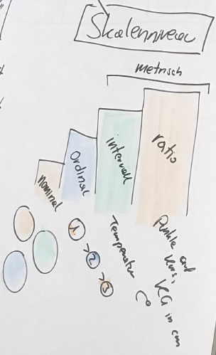

# Datenerhebung
## Problemstellung
Wie komme ich zu **aussagekräftigen** Daten?

`r LINK("https://youtu.be/9P7WwF8dPl0")`

## Verschiedene Verfahren der Stichprobenziehung
- Einfache Zufallsauswahl`r if(lec){": Jedes Element der Grundgesamtheit hat eine von null verschiedene, angebbare Wahrscheinlichkeit, in der Stichprobe berücksichtigt zu werden. Zum Beispiel: Listenauswahl (Telefonbuch), Random Digit Dialing, Lotterieauswahl, Random Route Verfahren."}`
- Klumpenstichprobe (Cluster)`r if(lec){": Erste Stufe: Klumpen= Schulklassen, Zweite Stufe: alle Elemente der Klumpen (SchülerInnen) werden befragt"}`
- Quotenstichprobe (Stratifikation)`r if(lec){": Eine Quote ist eine Merkmalsverteilung. Die Stichprobe wird derart konstruiert, dass die Quoten in der Stichprobe im Hinblick auf die ausgewählten Merkmale den Merkmalsverteilungen in der Grundgesamtheit entsprechen."}`
- Willkürliche Auswahl
    - Schneeballtechnik`r if(lec){": Bsp: Untersuchung über Homosexualität von Dannecker und Reiche (1974). Die Fragebögen wurden an homosexuelle Freunde und Bekannte verteilt, die ihrerseits Fragebögen im Freundes- und Bekanntenkreis weiterreichten. Auf Basis dieser Stichprobenauswahl können keine Aussagen über die Grundgesamtheit gemacht werden! Zusammenhangshypothesen können aber durchaus an willkürlichen Stichproben geprüft werden."}`
    - Convenience Sampling

Man kann auch (insb. in der qualitativen Forschung) nach datengesteuerte Verfahren (Zusammensetzung ergibt sich erst im Untersuchungsverlauf, z.B. fallkontrastierung oder bestätigende Auswahl) und theoriegesteuerte Verfahren unterscheiden (z.B. qualitative Stichprobenpläne).

## Fehlerquellen bei der Stichprobenziehung

- **Zufallsfehler** der Stichprobe
- **Systematische Fehler**
    - Stichprobenziehung
    - Messfehler
    - Fehlerquellen im Interview
    - Diskrepanz zwischen Zielpopulation und Surveypopulation
    - Non-Response
    - ...

## Erhebungsarten

> **Frage:** Welche Möglichkeiten zur Erhebung von Daten fallen dir ein? Hast du schon eigene Erfahrung mit einer dieser Methoden gemacht?

`r if(lec){"
- Beobachtung
- Experiment
- Befragung (diese Methode bekommt besonderen Fokus in dieser Lehrveranstaltung.)"}`

## Stichprobengröße

- Macht (Power) berechenbar
    - Abhängig von Komplexität des Modells
    - Abhängig von der größe der gesuchten Effekte
- Daumenregel: Fälle:Variablen ca. 1:10-20 

## Gütekriterien
> **Frage:** Welche Kriterien fallen dir ein, die quantitative Forschung "gut" machen?

`r if(lec){"
- Objektivität (Unabhängigkeit von den durchführenden Personen)
    - Durchführungsobjektivität (Unabhängigkeit der Messung von den Messenden)
    - Auswertungsobjektivität (Unabhängigkeit zwischen einer Auswertung und der auswertenden Personen)
    - Interpretationsobjektivität (Unabhängigkeit zwischen der interpretierenden Person und der Interpretation)
- Validität (es wird das gemessen, was gemessen werden soll)
    - Inhaltsvalidität (alle Aspekte werden gemessen)
    - Kriteriumsvalidität (hoher Zusammenhang zwischen dem gemessenen Konstrukt und eines externen Kriteriums)
    - Vorhersagevalidität (genaue Prognosen sind möglich)
- Reliabilität (wiederholte Messungen mit einem Messinstrument sollten unter den gleichen Bedingungen zu dem gleichen Ergebnis gelangen)"}`

## Messen
- Messen ist die Zuordnung von Zahlen zu Objekten gemäß festgesetzten Regeln.
- Strukturtreue`r if(lec){": die Zahlen müssen zueinander Beziehungen aufweisen, die den Beziehungen der gemessenen Objekte entsprechen."}` 

### Messniveau
Wir wandeln üblicher Weise alle Daten in Zahlen um (z.B. weiblich = 1, männlich = 2). Diese Zahlen (bzw. Codes) transportieren aber unterschiedliche Informationen:

- Nominalskala`r if(lec){": Von den Relationen zwischen den bei der Messung verwendeten Messwerten darf nur die Gleichheit bzw. Ungleichheit empirisch sinnvoll interpretiert werden. Nominale Daten werden auch kategoriale Daten genannt."}`
    - Disjunkt (Exklusivität)`r if(lec){": jede potenzielle Merkmalausprägung bekommt einen eigenen Code."}`
    - Erschöpfend (Exhausivität)`r if(lec){": alle potenziellen Merkmalausprägungen werden erfasst."}`
- Ordinalskala`r if(lec){": zusätzlich kann die Rangordnung empirisch sinnvoll interpretiert werden"}`
- Intervallskala`r if(lec){": zusätzlich können die Differenzen der Messwerte empirisch sinnvoll interpretiert werden."}`
- Ratioskala`r if(lec){": zusätzlich können die Größenverhältnisse der Messwerte empirisch sinnvoll interpretiert werden."}`

> **Frage:** Fallen dir Beispiele für jedes Messniveau ein?

`r if(lec){"
- Nominal: Religion, Staatsbürgerschaft, Geschlecht
- Ordinal: Likert-Skalen, Schulnoten
- Intervall: Temperatur
- Ratio: Einkommen, Körpergröße
"}`

`r if(lec){"
### Diskussion von Prüfungsfragen:

*Welches Messniveau hat Zeit (in Sekunden)? (s)*
Praktisch wird das für alle Analysen etc. keinen Unterschied machen, diese beiden Niveaus sind auch bei SPSS bzw. PSPP in einer zusammengefasst (Metrisch). Hier ist nur der Unterschied, dass es eine natürliche Null geben kann (also z.B. gar keine Zeit). Dann sind 2 Sekunden halb so lange wie 4 Sekunden. Das trifft auf nur intervallskalierte Daten nicht zu -- z.B. Temperatur (2 grad sind NICHT halb so warm wie 4 Grad, aber der Unterschied ist gleich groß wie zwischen 6 und 8 Grad.).

*Ab welchem Skalenniveau ist es sinnvoll das arithmetische Mittel zu errechnen? (s)*
Das kann erst sinnvoll sein, wenn ich etwas über die Lage der Messpunkte weiß. Denk mal an ordinale Daten wie zB das Schulnotensystem. Wenn ich hier einen Mittelwert der Noten 5 und 1 bilde ist das nicht sehr aussagekräftig, weil der 5er ja 0% oder auch 50% bedeuten kann. Oder denke an Geschlecht (nominalskaliert): Wir codieren die Geschlchter zwar oft als 0 und 1, aber ich könnte genausogut w und m schreiben. Damit lässt sich nicht gut rechnen.
"}`

## Messniveau Zusammenfassung

Messniveau  | Gleichheit | Rang    | Differenzen |  Verhältnisse  
----------  | :--------:  | :--------: | :--------: | :--------:
Nominal     | x |  |  | 
Ordinal     | x | x |  | 
Intervall   | x | x | x | 
Ratio       | x | x | x |x

## Demonstration in SPSS

### Aufgabe
Öffne die Beispieldaten und den Beispielartikel und identifiziere die vorgestellten Begriffe.

> **Video PSPP**: [Wird in der LV gedreht](TBA)

> **Video SPSS**: [Wird in der LV gedreht](TBA)

<!-- *****CLOSING CHUNK************ -->
## Übungen
- Öffne eine beliebige Datentabelle. Welche der vorgestellten Begriffe kannst du identifizieren?
- Überfliege den Methodenteil eines quantitativen / empirischen Aritkels. Welche der vorgestellten Begriffe kannst du identifizieren?

## Wiederholungsfragen
- Welche Stichprobeverfahren kennst du?
- Wes bedeutet *messen*?
- Welche Skalenniveaus kennst du und wie unterscheiden sie sich?

`r if(!lec){"
-------

Ende der Lektion.
"}`
<!-- ********************************** -->

## Datenmanagement

Fälle selektieren

`r LINK("https://youtu.be/QcABfU6wCBk")`

Daten umkodieren
`r LINK("https://youtu.be/H86eeEBsIdA")`

## Items zusammenfassen
- Skalen bilden`r if(lec){": Items können zu Mittelwerten oder Summen zusammengefasst werden, um Skalen zu bilden."}`

`r LINK("https://youtu.be/yXO5ST52Ufw")`

`r LINK("https://youtu.be/lgHBUx-jvDY")`

## Weiterführend

`r LINK("https://youtu.be/mhIirrb61BY")`
