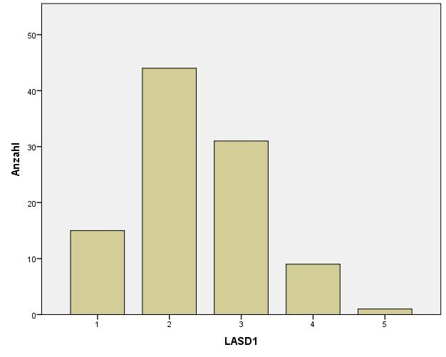
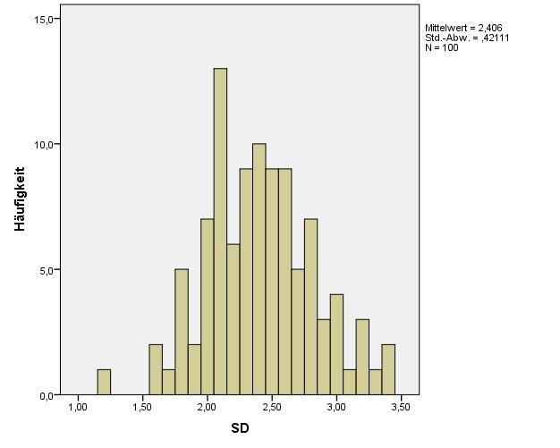

# Verteilungen

`r LINK("https://youtu.be/1gozoZ52UGQ")`
`r LINK("https://www.youtube.com/watch?v=8csTa3BVM5Q&t=63m47s")`

## Anknüpfungspunkte
- Lagemaße
- Streuungsmaße

## Vorbereitung
- Video: https://www.khanacademy.org/math/statistics-probability/sampling-distributions-library/sample-means/v/central-limit-theorem

## Normalverteilung
- wichtige Voraussetzung`r if(lec){": Die Annahme der Normalverteilung ist Voraussetzung für viel der weiteren Überlegungen der Inferenz- und Teststatistik"}`
- Sehr viele Merkmale sind normalverteilt`r if(lec){": Körpergröße, Intelligenz, Sehvermögen etc."}`
- Kennzeichen
    - unimodal/eingipfelig
    - glockenförmiger Verlauf
    - symmetrisch`r if(lec){": Median, Modus und arithmetisches Mittel sind identisch"}`

## Zentraler Grenzwertsatz
- Die Verteilung von arithmetischen Mittelwerten aus Stichproben derselben Grundgesamtheit vom Umfang n geht mit wachsendem n in eine Normalverteilung über.
- Die Annäherung an die Normalverteilung gilt ab n>30 (Daumenregel)
- [Video-Demonstration](https://www.youtube.com/watch?v=dlbkaurTAUg)

## Zentraler Grenzwertsatz - Demonstration, uniforme Verteilung

```{r, include=FALSE}

#from: https://stackoverflow.com/questions/40307510/central-limit-theorem-in-r
set.seed(123) ## set the seed for reproducibility
r <- 1000
n <- 100      ## I use 200 instead of 20 to enhance convergence to Gaussian

## this function computes the r samples of the sample mean from the 
## r*n original samples
sample.means <- function(samps, r, n) {
  rowMeans(matrix(samps,nrow=r,ncol=n))
}


library(ggplot2)
library(gridExtra)
qqplot.data <- function (vec) {
  # following four lines from base R's qqline()
  y <- quantile(vec[!is.na(vec)], c(0.25, 0.75))
  x <- qnorm(c(0.25, 0.75))
  slope <- diff(y)/diff(x)
  int <- y[1L] - slope * x[1L]

  d <- data.frame(resids = vec)

  ggplot(d, aes(sample = resids)) + stat_qq() + geom_abline(slope = slope, intercept = int, colour="red") + ggtitle("Q-Q plot")  
}

generate.plots <- function(samps, samp.means) {
  p1 <- qplot(samps, geom="histogram", bins=30, main="Sample Histogram")
  p2 <- qplot(samp.means, geom="histogram", bins=30, main="Sample Mean Histogram")
#  p3 <- qqplot.data(samp.means)
  grid.arrange(p1,p2,#p3,
               ncol=2)
}


```

```{r}
samps <- runif(r*n)  ## uniform distribution [0,1]
# compute sample means
samp.means <- sample.means(samps, r, n)
# generate plots
generate.plots(samps, samp.means)
```

## Zentraler Grenzwertsatz - Demonstration, Poisson Verteilung
```{r}
samps <- rpois(r*n,lambda=3)
# compute sample means
samp.means <- sample.means(samps, r, n)
# generate plots
generate.plots(samps, samp.means)

```


## Standardnormalverteilung
- X ~ N (0;1)
- Erwartungswert E(X) = 0
- Varianz (Var) = Standardabweichung (SD) = 1

### Wichtige Punkte der Normalverteilung
- [-1*SD, 1*SD] = 68%
- [-1,96*SD, 1,96*SD] = 95%
- [-2,58*SD, 2,58*SD] = 99%

## Standardnormalverteilung - Visualisierung

```{r, echo=FALSE}
par(mfrow=c(2,3))
hist(rnorm(n = 10, mean = 0, sd = 1))
hist(rnorm(n = 100, mean = 0, sd = 1))
hist(rnorm(n = 1000, mean = 0, sd = 1))
hist(rnorm(n = 10000, mean = 0, sd = 1))
hist(rnorm(n = 100000, mean = 0, sd = 1))
hist(rnorm(n = 1000000, mean = 0, sd = 1))
par(mfrow=c(1,1))
```

## z-Transformation
- Überführung einer Normalverteilung in die Standardnormalverteilung

$$ z = \frac{X - \bar{X}}{SD} $$

`r if(lec){"Interpretation der Formel: Zentrieren der Daten um 0; Dividieren durch die Standardabweichung um sicherzustellen, dass die Standardabweichung 1 ergibt."}`

## z-Transformation - Beispiel

```{r}
set.seed(1)
par(mfrow=c(2,2))
x <- rnorm(n = 320, mean = 50, sd = 30)
y <- rnorm(n = 270, mean = 20, sd = 8)
hist(x)
hist(y)
hist((x-50)/30)
hist((y-20)/8)
par(mfrow=c(1,1))
```

## Wieso Standardisierung?
- Vergleichbarkeit`r if(lec){": Auf der Basis der z-Werte ist es problemlos möglich, die Ergebnisse mehrerer auf unterschiedlichen Normalverteilungen basierender Messinstrumente zu vergleichen."}`
- Wahrscheinlichkeiten ablesbar`r if(lec){": Anhand der Standardnormalverteilungstabelle lassen sich die zu den z-Werten dazugehörigen Wahrscheinlichkeiten ablesen. Jedem z-Wert ist dort eine Fläche unter der Kurve zugeordnet, die dieser z-Wert nach links abschneidet - diese Fläche ist identisch mit der Wahrscheinlichkeit dafür, aus einer Population zufällig einen Wert zu ziehen, der kleiner oder gleich diesem z-Wert ist. Um die Wahrscheinlichkeit eines Intervalls zu bestimmen, muss man die Wahrscheinlichkeiten der z-Werte, die die Grenzen des Intervalls festlegen, voneinander subtrahieren."}`

## Übung mit Software

- Öffne den Datensatz "Froehlich et al 2014 Daten 100.sav" mit einem Statistik-Programm deiner Wahl.
- Stelle die Variable LASD1 im Histogramm dar.
    - Ist die Kurve (ungefähr) normalverteilt?
- Berechne eine neue Variable SD, die den Mittelwert von LASD1-LASDn bildet.
- Stelle die Variable SD im Histogramm dar.
    - Ist die Kurve (ungefähr) normalverteilt?
- Basierend auf dieser Übung, wie interepretierst du die Sinnhaftigkeit von Skalen (gegenüber einzelnen items)?


## Lösung der Übung
    



`r if(!lec){"-------"}`    

### Bildung des Mittelwerts (SPSS Syntax)

COMPUTE SD=MEAN(LASD1, LASD2, LASD3, LASD4, LASD5, LASD6, LASD7, LASD8, LASD9, LASD10).
EXECUTE.

Alternativer Syntax:

- Daten sortieren
- MEAN(LASD1 to LASD10)

`r if(!lec){"-------"}`


    
    `r if(!lec){"
-------

Ende der Lektion.
"}`
