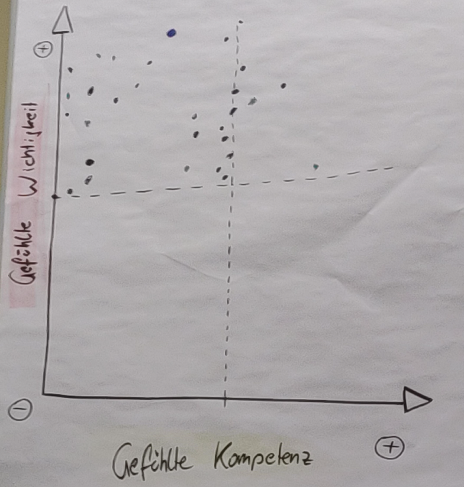
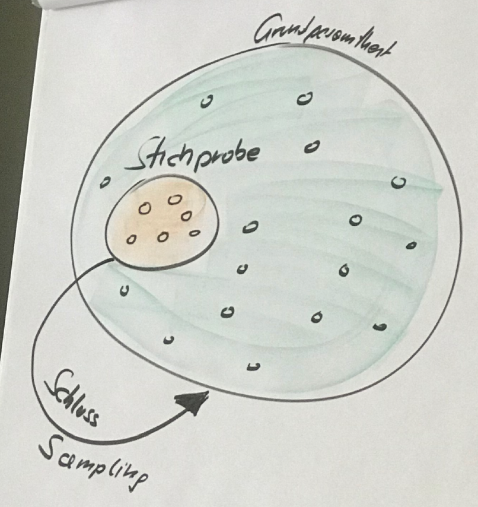

--- 
title: "Quantitative Forschung für HRM"
author: "Dominik E. Froehlich, www.dominikfroehlich.com"
date: "2020"
site: bookdown::bookdown_site
output: bookdown::pdf_book
documentclass: book
bibliography: ["references.bib"]
biblio-style: "apa.csl"
link-citations: true

# bookdown::gitbook:
#   config:
#     edit: https://github.com/dominikfroehlich/statHRM/edit/master/%s
---

```{r include=FALSE}
lec = T # TRUE = pdf
options(digits = 2)
library("htmltools")
library("vembedr") #embedding videos

LINK <- function(link){
  # if (knitr::is_latex_output()){
  #   print(paste("Video:",link))
  # }
  if (knitr::is_html_output()){
    vembedr::embed_url(link)
  } else {
    paste("Video:",link)
  }
  
}

SOC <- function(task){

    paste(task,"Poste deine Antwort")
 
}


knitr::opts_chunk$set(echo = FALSE)
```

# Über dieses Buch
In diesem Buch stelle ich das statistische Basiswerkzeug vor, um Analysen im HRM Bereich sinnvoll Software-gestützt auswerten zu können.

Warum?

Darum:


Weiterführende Ressourcen finden sich auf meiner [Homepage](https://dominikfroehlich.com/online-courses/) und dem [Agraphie Youtube Channel](https://www.youtube.com/channel/UCKg_rSScmeMkU0Jw6aDGdSw?view_as=subscriber)


<!--
This is how to embed videos:

`r LINK("https://www.youtube.com/watch?v=JwZo28RKdvU")`
-->

<!--chapter:end:index.Rmd-->

# Allgemeines

In diesem Kapitel klären wir einige Grundbegriffe auf der "Meta-Ebene". Wir beschäftigen uns hier mit den "großen" Fragen wie: **"Was können wir durch Statistik überhaupt wissen"?**

## Grundsätzliches

- (Neo)Positivismus: auch im menschlichen Bereich können Abläufe, Handlungen und Ereignisse, wie objektive Fakten erfasst werden`r if(lec){", obwohl die Gesetzmäßigkeiten in den Sozialwissenschaften selten so präzise sind wie in den Naturwissenschaften."}`

`r LINK("https://www.youtube.com/watch?v=kCJ52tpjG_Y")`

- Empirismus`r if(lec){": Intersubjektivität der Erkenntnis - Empirische Aussagen sind solche, deren Wahrheit od. Falschheit nur aufgrund von Erfahrungen gemacht werden können"}` 
- Wissenschaftlichkeit der Philosophie`r if(lec){": Die Philosophie sorgt für die Reinigung der Wissenschaft von metaphysischen Elementen und die Synthese der Wissenschaften durch ein umfassendes, widerspruchsfreies System der Erkenntnis"}`
- Einheit der Wissenschaft`r if(lec){": Grundsätzliche Einheit der Wissenschaftsmethodik in Bezug auf a) die Rolle der Erfahrung als einzige Instanz zur Überprüfung von Erkenntnis b) terminologische Exaktheit als Voraussetzung eindeutiger Kommunikation c) die Formulierung allgemeiner Gesetze und Theorien als Instrumente der Prognose und der nicht-metaphysisch-theologischen Erklärung."}`

### Definition Statistik
- Statistik = Wissenschaft von der **mengen- und zahlenmäßigen Erfassung** und **Auswertung** von Daten.[@Langenscheidt2017]
    - mengen- und zahlenmäßige Erfassung`r if(lec){": Aufgegriffen werden quantifizierbare Ausdrucksformen von Phänomenen, z.B. die Zahl der Auszubildenden im IT-Bereich; Die Mathematik fungiert dabei als Vermittlungssprache; Bedingung:  Das Phänomen muss sich auch zahlenmäßig ausdrücken lassen"}`
    - mengen- und zahlenmäßige Auswertung`r if(lec){": Aufdeckung von Tendenzen, Zusammenhängen etc. mit Hilfe von  statistischen Maßzahlen in Orientierung an die forschungsleitenden Fragen/Hypothesen"}`

## Überblick über den Prozess quantitativer Forschung
- Forschungsrahmen klären: Forschungsfrage, Theorien, etc.`r if(lec){" Anekdote: Karl Popper in einer Vorlesung: *Nehmt ein Blatt Papier und beobachtet!*. Zuhörer: *WAS sollen wir beobachten?*"}`

`r LINK("https://youtu.be/-D5Y7UG9xac")`

- Theoretische Grundlagen klären
    - Hypothesen ableiten
- Operationalisierung ("Gegenstandsbenennung"[@Atteslander2003]) und Planung der Untersuchung
- **Daten sammeln**
    - Erhebungsinstrumente erstellen, Quantifizierung`r if(lec){" (Achtung, die Quantifizierung stellt eine enorme Reduktion der Wirklichkeit dar!)"}`
    - Erhebung durchführen
    - Daten aufbereiten`r if(lec){": Fehlerkontrolle, Fehlerbereinigung"}`
- **Daten auswerten** / Hypothesen testen`r if(lec){": Bildung von Indizes, Itemanalysen, Skalenwerten; Univariate Statistiken; Zusammenhangsanalysen"}`
- **Ergebnisse interpretieren** 
- Berichterstattung

## Warum Statistik?
- Publizierte Statistiken interpretieren und beurteilen
Beispiel: [Der Fall Sally Clark](https://en.wikipedia.org/wiki/Sally_Clark)

`r LINK("https://www.youtube.com/watch?v=HqH-6yw60m0")` 

> **Frage:** Welche anderen Beispiele fallen dir ein?

- Eigene Statistiken produzieren (für die Abschlussarbeit!)
`r if(lec){"Nicht nur als Konsument fremder Arbeiten, sondern auch in der Rolle des Produzenten empirischer Ergebnisse ist die genaue Kenntnis der Prinzipien, Anwendungsvorraussetzungen und Probleme der wichtigsten statistischen Verfahren unverzichtbar!"}`

## Ziele der Statistik

- Deskription (Beschreiben)`r if(lec){": Beschreiben von Häufigkeiten von Ausprägungen der betrachteten Merkmale; Grafische Datenaufbereitung; Gewinnung erster Eindrücke bzw. Ideen zur weiteren Analyse; Datenvalidierung: Erkennen von Fehlern im Datensatz"}`
- Exploration (Suchen)`r if(lec){": Auffinden von Strukturen in den Daten; Formulierung von Hypothesen für das den Daten zugrunde liegende stochastische (=vom Zufall abhängig) Modell"}`
- Inferenz (Schließen)`r if(lec){": Schlüsse von einer Stichprobe auf die Grundgesamtheit ziehen"}`



> **Frage:** Welche Beispiele fallen dir im Rahmen von HRM für diese Ziele der Statistik ein?

<!--chapter:end:010-allgemeines.Rmd-->

# Wichtige Begriffe

`r LINK("https://www.youtube.com/watch?v=G0MIrYZ29dE&feature=youtu.be&7qj1tHFjpXuyr=")` 

## Allgemeines
- Empirie: Auf Erfahrung, 'der Realität' beruhend.
- Empirische Sozialforschung: systematische und reflektierte Erfassung und Interpretation von sozialen Tatbeständen (vgl. Kleining 2001, p. 209)
- Generierung von Wissen
    - **Induktion**: Von Beobachtung zur allgemeinen Aussage
    - **Deduktion**: Von Theorie zu Einzelaussage
    - **Abduktion**: Von einer Beobachtung wird auf Gesetzmäßigkeit UND Ursache geschlossen   
- Untersuchungsgegenstand: Um was geht es in diesem Forschungsprojekt?
- Gegenstandsangemessenheit: Forschung soll sich  auf eine angemessene und verständnisorientierte Art und Weise dem Feld annähern.

## Datenerhebung
- Untersuchungsobjekt: Wer wird untersucht?
    - Grundgesamtheit`r if(lec){"(engl. population): Unter einer Grundgesamtheit oder Population versteht man die Menge aller potenziellen Untersuchungsobjekte, über die man durch eine  Erhebung Aussagen machen möchte (sachlich, räumlich, zeitlich)."}`
          - Parameter`r if(lec){": ein Parameter beschreibt die Grundgesamtheit (z.B. Mittelwert der Grundgesamtheit)."}`
    - Stichprobe`r if(lec){"(engl. sample): Eine Stichprobe ist eine beschränkte Auswahl aus der Grundgesamtheit. Ziel: auf der Basis der Stichprobenergebnisse Aussagen über die Grundgesamtheit zu machen. Die Stichprobe muss repräsentativ für die Grundgesamtheit sein (siehe Stichprobenziehung)."}`
          - Statistik`r if(lec){": eine Statistik beschreibt die Stichprobe (z.B. Mittelwert der Stichprobe)."}`
- Stichprobenziehung`r if(lec){": Ein Stichprobenverfahren ist charakterisierbar durch eine explizite Vorschrift, die festlegt, in welcher Weise Elemente der Grundgesamtheit ausgewählt werden."}`
    - Ziel`r if(lec){": In quantitativen Studien hat die Stichprobenziehung Repräsentativität (z.B. basierend auf demografischer Merkmale) zum Ziel. Qualitativ geht es eher um inhaltliche Repräsentativität"}`
    - Fall Gallup gegen Literary Digest`r if(lec){": Vereinigte Staaten, 1930er Jahre: Die Zeitschrift Literary Digest hat bei den Wahlen 1936 zehn Millionen Probestimmzettel an Amerikaner verschickt, deren Adressen im Verzeichnis Telephon and Auto eingetragen waren - 2,4 Millionen Stimmzettel kamen zurück. Ergebnis : Landon wird Präsident. George Gallup wählte eine andere Methode: er bildete eine relativ kleine Stichprobe, die in wesentlichen Merkmalen einem verkleinerten Abbild der amerikanischen Wählerschaft entsprach - Ergebnis: Franklin D. Roosevelt wird Präsident! Gallup traf ins Schwarze und Literary Digest unterschätzte die Stimmenzahl Roosevelts um 19%."}`
- Primär vs. Sekundärstatistik`r if(lec){": Primärstatistiken (Field Research) zeichnen sich dadurch aus, dass ihnen eine eigene Erhebung zugrunde liegt. Diese Erhebungen ermöglichen es dem Statistiker, die Fragestellung hinsichtlich Erhebungszweck, Aktualität und Erfordernisse der Datenerfassung. Sekundärstatistiken sind erneute Analysen bereits durchgeführter Untersuchungen"}`

## Variablen und Fälle
- Variablen`r if(lec){": Eine Variable ist ein Name für ein Merkmal oder eine Eigenschaft von Personen, Gruppen, Organisationen oder anderen Merkmalsträgern. Beispiele für Variablen: Geschlecht, Bildungsgrad von Personen, die soziale Integration von Gruppen, die Dauer von Ehen, die Regierungsform von Staaten, die Seitenzahl eines Buches. In der Datentabelle stehen sie typischer Weise in den Spalten."}`
    - unabhängige Variable`r if(lec){": Jene Variable, die als verursachender Faktor in einer Hypothese betrachtet wird, heißt unabhängige Variable (independent variable, IV)."}`
    - abhängige Variable`r if(lec){": Jene Variable, die als bewirkter Faktor in einer Hypothese betrachtet wird, heißt abhängige Variable (dependent variable, DV).
    
        - Beispiele:
            -Raumtemperatur (unabhängige Variable) und das damit korrelierende Wohlbefinden (abhängige Variable) einer Testperson
            - Erziehungsstil (unabhängige Variable) und Berufswahl (abhängige Variable)"}`
- Fälle`r if(lec){": Fälle stellen z.B. die befragten Personen dar. In der Datentabelle stehen sie typischerweise in den Reihen."}`
    - Merkmalsträger`r if(lec){": Personen haben individuelle Merkmale; Bsp: Geschlecht, Alter, Bildung, Familienstand, sozialer Status, Einkommen. Personenmehrheiten (Kollektive) haben Kollektivmerkmale. Wahlsprengel V hat das Merkmal Stimmenanteil Partei Y, Großstadt W hat das Merkmal Kriminalitätsrate, Staat X hat das Merkmal politische Verfassung, Haushalt Z hat das Merkmal Einkommen"}`
- Wert = (Merkmals)Ausprägung`r if(lec){":
        - Jede Variable hat mindestens zwei Ausprägungen.
        - Die Ausprägungen müssen auf einer Dimension liegen.
        - disjunkt, d.h. sie dürfen sich nicht überlappen.
        - erschöpfend, d.h. jeder Merkmalsträger muss einer Kategorie zugewiesen werden"}`
 
`r if(!lec){"-------"}` 

Ein Auszug aus der Datentabelle des Beispielartikels:

```{r, echo=FALSE, message=TRUE, warning=TRUE}
fro <- read.csv2(file = "Data//Froehlich et al 2014 Daten 100.csv")
print(fro[1:3, c("DSEX", "DAGE", "LADP1")])
``` 

> **Frage:** Was sind die Variablen/Fälle/Werte in diesem Ausschnitt?
    
`r if(!lec){"-------"}`
    
- Item vs. Skala bzw. manifeste vs. latente Variable`r if(lec){": Bei latenten Variablen handelt es sich um nicht direkt beobachtbare, sozusagen versteckte Phänomene. Zum Beispiel kann die Persönlichkeit einer Person nicht direkt und eindeutig beobachtet werden oder auch nur durch eine einzelne Frage erfragt werden. Persönlichkeitstests sind daher typischer weise recht lang--viele **items** bzw. beobachtbare Elemente, d.h. **manifeste Variablen**, sind notwendig, um das latente Konstrukut Persönlichkeit zu messen. Diese items werden in **Skalen** bzw. Item-Batterien zusammengefasst.

Beispiel: Man füllt einen Persönlichkeits-Fragebogen mit zehn Fragen aus. Diese zehn Fragen werden bei der Auswertung dann kombiniert (z.B. durch das bilden einer Summe oder des Mittelwerts), um z.B. den Zusammenhang zwischen Alter (einer direkt beobachtbaren, manifesten Variable) und Persönlichkeit zu erforschen.

Andere Erklärung: Die manifeste Variable ist eine festgesetzte Variable, die man anhand einer Frage beantworten kann. (In welchem Semester studierst du?) Sie ist eindeutig erfassbar.Die latente Variable ist eine nicht einfach ersichtliche Variable. Sie muss durch mehrere zusammenhängende Fragen beantworten werden. (Am Beispiel der Motivation, die nicht offensichtlich beobachtbar ist, könnten Fragen zum Lernverhalten gestellt werden.) Daher ist die latente Variable nicht eindeutig erfassbar."}`

## Datenauswertung

- Hypothese`r if(lec){": Eine Hypothese ist die Behauptung eines vermuteten **Zusammenhangs** zwischen zwei (oder mehr) Variablen. Diese müssen überprüfbar sein. Keine wissenschaftlichen Hypothesen sind Beschreibungen (Petra ist 1,70m groß), Klassifikationen (Wien ist in 23 Bezirke eingeteilt), Analogien (Liebe ist wie das Eintauchen im Ozean), Orientierungsaussagen (das Sein bestimmt das Bewusstsein), normative Aussagen (Wenn Angestellte viel Verantwortung tragen, dann sollen sie auch gut bezahlt werden.)"}`
    - Unterschiedshypothese`r if(lec){": Ist die unabhängige Variable dichotom (d.h. besitzt sie nur zwei Ausprägungen), so kann der Zusammenhang zwischen den beiden Variablen als Wenn-dann-Hypothese formuliert werden."}`
    - Zusammenhangshypothese`r if(lec){": Sind die Ausprägungen sowohl der unabhängigen als auch der abhängigen Variablen als Rangfolge interpretierbar, so kann der Zusammenhang als Je-desto-Hypothese formuliert werden."}`
    - Tautologien`r if(lec){": Tautologie (griech. 'Wiederholung von bereits Gesagtem') bezeichnet eine Aussage, die immer wahr ist. Tautologien (=allgemein gültige Aussagen) sind ein Konzept aus der Logik. Eine Tautologie ist eine Aussage oder logische Formel, die in jeder Situation bzw. variablen Belegung wahr ist.
        - Wenn der Hahn kräht auf dem Mist, dann ändert sich das Wetter oder es bleibt wie es ist. (Hier wird vermeintlich eine Aussage getroffen, über die Fähigkeit eines Hahnes das Wetter zu ändern. Betrachtet man den zweiten Teil des Satzes genau, sieht man dass das **oder** beide möglichen Fälle (positiv und negativ) abdeckt. Somit ist dieser Teil des Satzes immer wahr. Bei dem ersten Teil des Satzes handelt es sich um eine Implikation. Eine Implikation ist dann wahr, wenn die Grundaussage falsch ist, hier wenn der Hahn nicht auf dem Mist krähen würde oder wenn beide Teile der Aussage wahr sind. Wie bereits geklärt der zweite Teil ist immer wahr und somit ist die gesamte Aussage auch immer wahr, daher ist sie eine Tautologie.)
        - Je schwächer die Beschäftigungsdynamik desto höher die Arbeitslosigkeit. Wenn negative Kindheitserfahrung, dann neurotische Symptome.
        - Wenn keine negativen Kindheitserfahrungen und trotzdem neurotische Symptome - dann liegt Verdrängung vor.
        - Alle Menschen sind Menschen
        - Heute ist Mittwoch oder es ist nicht Mittwoch"}`
        
## Übung mit Software
- Öffne den Datensatz "Froehlich et al 2014 Daten 100.sav" mit einem Statistik-Programm deiner Wahl.
- Identifiziere Variablen, Fälle und Werte.
- Datensätze in Software
`r LINK("https://www.youtube.com/watch?v=P3rMejsj6kY")` 


## Wiederholungsfragen
- Definiere Grundgesamtheit und Stichprobe.
- Unterscheide zwischen Variablen und Fällen.
- Definiere abhängige/unabhängige und latente/manifeste Variablen.
- Was macht gute Hypothesen aus?
- Denke an eine Politik-Meinungsumfrage im Rahmen einer kommenden Wahl in Österreich (Bitte antworte in 1-2 Sätzen pro Unter-Frage.). 
    - (a) Was ist hier die Grundgesamtheit ...
    - (b)...und wie wird sie formal definiert?
    - (c) Was ist die Stichprobe...
    - (d)...und wie wird sie formal definiert?


    
    `r if(!lec){"
-------

Ende der Lektion.
"}`


<!--chapter:end:011-begriffe.Rmd-->

# Software

## IBM SPSS Statistics bzw. PSPP

### PSPP: Probleme beim Öffnen von .csv Dateien in MacOS
Wenn du die Fehlermeldung "Could not read the contents of..." bekommst, versuche folgende Lösungen

- Lösche PSPP komplett, und installiere es neu (dazwischen am besten auch den Computer neustarten)
- Importiere die Daten mittels "Drag und Drop"
   - Öffne neben PSPP ein Finder Fenster , und wähle die Datei aus, die du importieren willst (Wichtig! Die Datei *muss* sich in deiner öffentlichen Mappe befinden, sonst bekommt man diesselbe Fehlermeldung)
   - In PSPP, klicke auf "Datei" und dann "Daten importieren" (falls .csv Datei ist)
   - Ziehe  die Datei vom Finder Fenster ins PSPP Fenster
- Gib PSPP manuell Zugriff auf die Festplatte:
   - Schließe PSPP
   - Öffne Systemeinstellungen
   - Geh zur "Sicherheit"
   - Klicke auf "Datenschutz" (rechts oben)
   - Klicke auf "Festplattenvollzugriff" in der linken Liste
   - Mach das Schloss links unten auf
   - Klicke auf "+" und wähle PSPP aus
   - Schließe das Schloss und die Systemeinstellungen


### Dateiformate

`r LINK("https://youtu.be/f7qft7LK6S8")`

Wichtige Datienformate sind

- für **Daten**
    - .sav`r if(lec){" (das SPSS Standard-Datenformat)"}`
    - .csv`r if(lec){" (ein einfacher Text mit [comma separated values](https://en.wikipedia.org/wiki/Comma-separated_values))"}`
- für **Syntax**
    - .sps`r if(lec){" (das SPSS Standard-Syntaxformat)"}`
- für Ausgaben
    - .spv
    
## R
R ist eine frei verfügbare, statistische Programmiersprache.

## Allgemeines
R hat eine sehr aktive onine Community. Bei Fragen findet eine kurze Suche oft zu guten Lösungen -- nutze diese Möglichkeit! Es gibt bereits so viel Einführungsmaterial für R (auch auf Deutsch [@Manderscheid2012]), dass sich dieses Kapitel eigentlich erübrigt. Viele Texte enthalten aber viel zu viele Informationen, die ich für nicht notwendig für die Praxis bzw. den Einstieg in R erachte. Daher möchte ich ganz kurz die wichtigsten Befehle erwähnen; für das "Verstehen" der Inhalte muss aber eventuell in anderen Quellen nachgeschlagen werden.

## Installation & Setup
Neben der Installation von R empfehle ich die Installation von RStudio.

## Packages
Durch packages kann die Funkionalität Rs sehr flexibel erweitert werden. Packages müssen zuerst mit install.packages() installiert werden und können dann mit library() geladen werden.

## Allgemeiner Syntax
- Funktionen werden mit function() augerufen.
    - Innerhalb der Klammer befinden sich dann die Argumente.
- Die Raute wird für Kommentare benutzt
- Zuweisungen erfolgen mit "<-"


<!--chapter:end:012-software.Rmd-->

# Das Beispielprojekt: Froehlich et al. 2014 / Datenimport

## Dateien
- Artikel
- Fragebogen
- Daten (gekürzt auf n = 100)

## Übersicht
```{r, message=FALSE, warning=FALSE, include=FALSE}
fro <- read.csv2(file = "Data//Froehlich et al 2014 Daten 100.csv")
```

**Variablen** im Datensatz:
```{r}
names(fro)
```


`r if(!lec){"-------"}`

**Fälle** im Datensatz:
```{r}
length(fro)-1
```

## Daten importieren

### in R
Wir wollen den Beispieldatensatz (im .csv Format) laden. Dafür benutzen wir die Funktion read.csv2(). Um die weitere Arbeit zu erleichtern, weisen wir die Daten dem (neuen) Objekt "data" zu.

```{r, echo=TRUE}
data <- read.csv2(file = "Data//Froehlich et al 2014 Daten 100.csv")
```

Wir können uns die Spalten (=Variablen), die jetzt in dem Objekt gespeichert sind, mit der Funktion names() anzeigen lassen.

```{r, echo=TRUE}
names(data)
```

Die Anzahl der Reihen bekommt man mit length(), das für alle Objekttypen die Länge angibt.

```{r, echo=TRUE}
length(data)
```


Es gibt verschiedene Objekttypen, die in R verwendet werden. Unsere Datensätze werden wir meistens in sogenannten data.frames speichern.

```{r, echo=TRUE}
class(data)
```

Wichtig sind noch Vektoren, die eine Menge an Zeichen enthalten können (die z.B. mit c() kombiniert werden). Es können Zahlen ("numeric") und auch Text bzw. Zeichen ("character") zusammen abgespeichert werden. Ausgegeben kann der Inhalt von Objekten einfach werden, indem der Objektname angegeben wird oder print() benutzt wird.

```{r, echo=TRUE}
zahlen <- c(1, 2, 4)
length(zahlen)
zahlen
print(zahlen)
class(zahlen)
```

Beachte was passiert, wenn wir einen "character string" hinzufügen.

```{r, echo=TRUE}
zahlen <- c(zahlen, "fünf")
length(zahlen)
zahlen
print(zahlen)
class(zahlen)
```

Wir können auch einzelne Inhalte des Vektors aufrufen, indem wir den Index des gewünschten Inhalts in [] nach dem Objektnamen angeben.

```{r, echo=TRUE}
zahlen[3]
```

Natürlich lassen sich auch mehrere Punkte gleichzeitig ausgeben.

```{r, echo=TRUE}
zahlen[2:4] #2 bis 4
zahlen[c(2, 4)] #2 und 4
```

Auch eine Negativauswahl ist möglich
```{r}
zahlen[-2]
```


Das funktioniert für alle Objekttypen mehr oder weniger gleich. Bei data.frames müssen wir nur sowohl die Reihe als auch die Spalte definieren.

```{r}
data[2, 5]
data[1:3, 2:4]
```

Man könnte auch die Spaltennamen verwenden.

```{r}
data[1:5, c("DSEX", "DHIE")]
```

Man kann auch auf die Ausprägungen filtern bzw. mehrere Selektionen aufeinander "stapeln".

```{r}
data[data$DBAN =="5", 1:10]
```


Dateien in anderen Formaten können auch--ggf. durch den Einsatz von packages wie foreign--eingelesen werden.


### in SPSS

> TBA

## Daten manipulieren
Wenn wir mit Daten arbeiten, brauchen wir einige Datenmanipulations-Vorgänge immer wieder. Zum Beispiel wollen wir einige items zu einer Skala zusammenfügen (bzw. den Mittelwert der items bilden).


### Items umkodieren
- "umgedrehte Items"`r if(lec){": Bei Skalen werden oft einige Items *umgekehrt* erfragt. Die Items sollten aber vor der Analyse alle *in die selbe Richtung* gehen."}` 
- Beispiel 5-Punkt Likert Skala`r if(lec){": 1->5, 2->4, 3->3, 4->2, 5->1"}`


### in R
```{r echo=TRUE}
# (Optionales) sortieren von "data" nach Variablennamen
data <- data[, order(names(data))]
names(data)

# Selektion einer Skala
names(data[95:101])

# Speicherung des Reihen-Mittelwerts in einer neuen Variable
data$WC.mean <- rowMeans(data[95:101])
head(data$WC.mean) #zeige die ersten Einträge an (zur Kontrolle)

hist(data$WC.mean) # Darstellung im Histogramm
```

<!--chapter:end:013-daten.Rmd-->

# Datenerhebung
## Problemstellung
Wie komme ich zu **aussagekräftigen** Daten?

`r LINK("https://youtu.be/9P7WwF8dPl0")`


## Verschiedene Verfahren der Stichprobenziehung
- Einfache Zufallsauswahl`r if(lec){": Jedes Element der Grundgesamtheit hat eine von null verschiedene, angebbare Wahrscheinlichkeit, in der Stichprobe berücksichtigt zu werden. Zum Beispiel: Listenauswahl (Telefonbuch), Random Digit Dialing, Lotterieauswahl, Random Route Verfahren."}`
- Klumpenstichprobe (Cluster)`r if(lec){": Erste Stufe: Klumpen= Schulklassen, Zweite Stufe: alle Elemente der Klumpen (SchülerInnen) werden befragt"}`
- Quotenstichprobe (Stratifikation)`r if(lec){": Eine Quote ist eine Merkmalsverteilung. Die Stichprobe wird derart konstruiert, dass die Quoten in der Stichprobe im Hinblick auf die ausgewählten Merkmale den Merkmalsverteilungen in der Grundgesamtheit entsprechen."}`
- Willkürliche Auswahl
    - Schneeballtechnik`r if(lec){": Bsp: Untersuchung über Homosexualität von Dannecker und Reiche (1974). Die Fragebögen wurden an homosexuelle Freunde und Bekannte verteilt, die ihrerseits Fragebögen im Freundes- und Bekanntenkreis weiterreichten. Auf Basis dieser Stichprobenauswahl können keine Aussagen über die Grundgesamtheit gemacht werden! Zusammenhangshypothesen können aber durchaus an willkürlichen Stichproben geprüft werden."}`
    - Convenience Sampling

Man kann auch (insb. in der qualitativen Forschung) nach datengesteuerte Verfahren (Zusammensetzung ergibt sich erst im Untersuchungsverlauf, z.B. fallkontrastierung oder bestätigende Auswahl) und theoriegesteuerte Verfahren unterscheiden (z.B. qualitative Stichprobenpläne).

## Fehlerquellen bei der Stichprobenziehung

- **Zufallsfehler** der Stichprobe
- **Systematische Fehler**
    - Stichprobenziehung
    - Messfehler
    - Fehlerquellen im Interview
    - Diskrepanz zwischen Zielpopulation und Surveypopulation
    - Non-Response
    - ...

## Erhebungsarten

> **Frage:** Welche Möglichkeiten zur Erhebung von Daten fallen dir ein? Hast du schon eigene Erfahrung mit einer dieser Methoden gemacht?

`r if(lec){"
- Beobachtung
- Experiment
- Befragung (diese Methode bekommt besonderen Fokus in dieser Lehrveranstaltung.)"}`

## Stichprobengröße

- Macht (Power) berechenbar
    - Abhängig von Komplexität des Modells
    - Abhängig von der größe der gesuchten Effekte
- Daumenregel: Fälle:Variablen ca. 1:10-20 

## Gütekriterien
> **Frage:** Welche Kriterien fallen dir ein, die quantitative Forschung "gut" machen?

`r if(lec){"
- Objektivität (Unabhängigkeit von den durchführenden Personen)
    - Durchführungsobjektivität (Unabhängigkeit der Messung von den Messenden)
    - Auswertungsobjektivität (Unabhängigkeit zwischen einer Auswertung und der auswertenden Personen)
    - Interpretationsobjektivität (Unabhängigkeit zwischen der interpretierenden Person und der Interpretation)
- Validität (es wird das gemessen, was gemessen werden soll)
    - Inhaltsvalidität (alle Aspekte werden gemessen)
    - Kriteriumsvalidität (hoher Zusammenhang zwischen dem gemessenen Konstrukt und eines externen Kriteriums)
    - Vorhersagevalidität (genaue Prognosen sind möglich)
- Reliabilität (wiederholte Messungen mit einem Messinstrument sollten unter den gleichen Bedingungen zu dem gleichen Ergebnis gelangen)"}`

## Messen
- Messen ist die Zuordnung von Zahlen zu Objekten gemäß festgesetzten Regeln.
- Strukturtreue`r if(lec){": die Zahlen müssen zueinander Beziehungen aufweisen, die den Beziehungen der gemessenen Objekte entsprechen."}` 

### Messniveau
Wir wandeln üblicher Weise alle Daten in Zahlen um (z.B. weiblich = 1, männlich = 2). Diese Zahlen (bzw. Codes) transportieren aber unterschiedliche Informationen:

- Nominalskala`r if(lec){": Von den Relationen zwischen den bei der Messung verwendeten Messwerten darf nur die Gleichheit bzw. Ungleichheit empirisch sinnvoll interpretiert werden. Nominale Daten werden auch kategoriale Daten genannt."}`
    - Disjunkt (Exklusivität)`r if(lec){": jede potenzielle Merkmalausprägung bekommt einen eigenen Code."}`
    - Erschöpfend (Exhausivität)`r if(lec){": alle potenziellen Merkmalausprägungen werden erfasst."}`
- Ordinalskala`r if(lec){": zusätzlich kann die Rangordnung empirisch sinnvoll interpretiert werden"}`
- Intervallskala`r if(lec){": zusätzlich können die Differenzen der Messwerte empirisch sinnvoll interpretiert werden."}`
- Ratioskala`r if(lec){": zusätzlich können die Größenverhältnisse der Messwerte empirisch sinnvoll interpretiert werden."}`

> **Frage:** Fallen dir Beispiele für jedes Messniveau ein?


`r if(lec){"
- Nominal: Religion, Staatsbürgerschaft, Geschlecht
- Ordinal: Likert-Skalen, Schulnoten
- Intervall: Temperatur
- Ratio: Einkommen, Körpergröße
"}`


`r if(lec){"
### Diskussion von Prüfungsfragen:

*Welches Messniveau hat Zeit (in Sekunden)? (s)*
Praktisch wird das für alle Analysen etc. keinen Unterschied machen, diese beiden Niveaus sind auch bei SPSS bzw. PSPP in einer zusammengefasst (Metrisch). Hier ist nur der Unterschied, dass es eine natürliche Null geben kann (also z.B. gar keine Zeit). Dann sind 2 Sekunden halb so lange wie 4 Sekunden. Das trifft auf nur intervallskalierte Daten nicht zu -- z.B. Temperatur (2 grad sind NICHT halb so warm wie 4 Grad, aber der Unterschied ist gleich groß wie zwischen 6 und 8 Grad.).

*Ab welchem Skalenniveau ist es sinnvoll das arithmetische Mittel zu errechnen? (s)*
Das kann erst sinnvoll sein, wenn ich etwas über die Lage der Messpunkte weiß. Denk mal an ordinale Daten wie zB das Schulnotensystem. Wenn ich hier einen Mittelwert der Noten 5 und 1 bilde ist das nicht sehr aussagekräftig, weil der 5er ja 0% oder auch 50% bedeuten kann. Oder denke an Geschlecht (nominalskaliert): Wir codieren die Geschlchter zwar oft als 0 und 1, aber ich könnte genausogut w und m schreiben. Damit lässt sich nicht gut rechnen.
"}`


## Messniveau Zusammenfassung

Messniveau  | Gleichheit | Rang    | Differenzen |  Verhältnisse  
----------  | :--------:  | :--------: | :--------: | :--------:
Nominal     | x |  |  | 
Ordinal     | x | x |  | 
Intervall   | x | x | x | 
Ratio       | x | x | x |x

## Demonstration in SPSS

### Aufgabe
Öffne die Beispieldaten und den Beispielartikel und identifiziere die vorgestellten Begriffe.


<!-- *****CLOSING CHUNK************ -->
## Übungen
- Öffne eine beliebige Datentabelle. Welche der vorgestellten Begriffe kannst du identifizieren?
- Überfliege den Methodenteil eines quantitativen / empirischen Aritkels. Welche der vorgestellten Begriffe kannst du identifizieren?

## Wiederholungsfragen
- Welche Stichprobeverfahren kennst du?
- Wes bedeutet *messen*?
- Welche Skalenniveaus kennst du und wie unterscheiden sie sich?


`r if(!lec){"
-------

Ende der Lektion.
"}`
<!-- ********************************** -->

## Datenmanagement

Fälle selektieren

`r LINK("https://youtu.be/QcABfU6wCBk")`

Daten umkodieren
`r LINK("https://youtu.be/H86eeEBsIdA")`

## Items zusammenfassen
- Skalen bilden`r if(lec){": Items können zu Mittelwerten oder Summen zusammengefasst werden, um Skalen zu bilden."}`

`r LINK("https://youtu.be/yXO5ST52Ufw")`

`r LINK("https://youtu.be/lgHBUx-jvDY")`


## Weiterführend

`r LINK("https://youtu.be/mhIirrb61BY")`

Gütekrieterien: Ein Beispiel
`r LINK("https://www.youtube.com/watch?v=PNJHwd4wF6U&t=37m00s")`

<!--chapter:end:030-datenerhebung.Rmd-->

# Fragebogenkonstruktion 

`r LINK("https://youtu.be/A8olV9C-02Q")`

## Vorbereitung
- Ps: 5, 9
- K13: 10
- Hinkin, T. R. (1995). A review of scale development practices in the study of organizations. Journal of Management, 21(5), 967-988. doi:10.1016/0149-2063(95)90050-0
- Videos: https://www.khanacademy.org/math/statistics-probability/designing-studies/sampling-and-surveys/v/reasonable-samples

## Fragebogen
- standardisierte Zusammenstellung von Items (~Fragen)`r if(lec){" (es sind aber nicht-standardisierte Abläufe / Reihenfolgen Denkbar, z.B. bei Online Fragebögen oder bei Telefonumfragen, die mit entsprechenden Logiken hinterlegt sind.)"}`
- Analogie: Prüfungen`r if(lec){": eine schriftliche Prüfung ist sehr vergleichbar mit einem Fragebogen -- Man will durch ein standardisiertes Verfahren etwas über ein latentes Konstrukt erfahren (z.B. Statistik-Wissen/Kompetenz). Versuche diese Analogie auch an anderen Stellen dieses Skriptums anzuwenden."}`

### Stärken
- Quantifizierbare Ergebnisse
- Repräsentative Ergebnisse
- Vergleichbare Ergebnisse

### Schwächen
- Erfasst nur das, was vorher festgelegt wurde
- Kaum individuelles Eingehen auf Befragte möglich
- Kaum Möglichkeit zu Nachfragen

## Fragebogen wird beeinflusst von
- Forschungsfrage und Hypothesen
- Befragungsart`r if(lec){" (z.B.: schriftlich, online"}`
- Verfahren der Stichprobenziehung
- Prozess der Fragebogenentwicklung `r if(lec){" (z.B.: Teams vs. Einzelpersonen, bestehendes Material)"}`
- Pre-Tests `r if(lec){" (z.B.: Feldtests, kognitive Interviews)"}`
- Eigenschaften der Stichprobe`r if(lec){" (z.B.: Lesekompetenz)"}`
- Erhebungssituation`r if(lec){" (z.B.: Verfügbare Zeit)"}`

## Befragungsarten

Art | schriftl. | face2f. | tel. | online |
--------|:-------:|:-------:|:-------:|:-------:
Interviewer-Effekte | |- |- | | |
Kosten/Zeit | |- |- |+ | |
Anonymität| |- |- |+ |
Nachfragen | |+ |+ | |
Dateninput | | |+ |+ |
Erreichbarkeit | ? |? | ? | ? |

## Items
Items setzen sich zusammen aus...

- Itemstamm (prompt, Frage)
    - Fragen
    - Bild
    - Aufgabe
    - ...
- Antwortformat (response scale)
    - frei
    - gebunden (z.B. Likert-Skala / Guttman-Skala)

> **Frage:** Suche nach einen Fragebogen (wissenschaftlich oder nicht) und identifiziere unterschiedliche Itemstämme bzw. Antwortformate.

## Arten von Fragen
- Unterteilung nach Inhalten`r if(lec){": Fragen nach Wissen und Verhalten, Fragen nach Wertorientierungen, Einstellungen oder Meinungen, Fragen nach Merkmalen der Person"}`
- Unterteilung nach Form`r if(lec){": Offene Fragen, Halboffene Fragen, Geschlossene Fragen"}`

> **Frage:** Gib Beispiele für offene bzw. geschlossene Fragen.

## Offene vs. geschlossene Fragen
### Geschlossene Fragen
+ standardisiert
+ schneller in Befragung und Auswertung
- Befragte finden sich eventuell nicht in der Kategorie wieder

> **Frage:** Wann würdest du geschlossene Fragen stellen?
`r if(lec){"Das Spektrum der Antworten ist bekannt / nicht zu groß; Der Sachverhalt der Frage ist bekannt"}`

### Offene Fragen
+ Befragte können frei und ihren Gewohnheiten entsprechend antworten
- Abhängigkeit von Verbalisierungsfähigkeit
- Aufwendig in Befragung und Auswertung

> **Frage:** Wann würdest du offene Fragen stellen?
`r if(lec){"Die Frage behandelt ein neues Thema; die Begrifflichkeiten der Befragten sind von Interesse; die Motivation der Befragten soll gestärkt werden"}`

## Kriterien für gute Fragen
- Eindeutigkeit
- Präzision`r if(lec){": kurze Fragen sind besser"}`
- Verständlichkeit

## Quellen für Fragen
- eigene Überlegungen
    - ggf. basierend auf wissenschaftliche Modelle und Theorien
- bestehende Skalen zu ähnlichen Themen
    - die "großen" Fragebögen: ESS, ISSP, ALLBUS.
    - aus der wissenschaftlichen Literatur
    
`r if(lec){"Hinweis: Die wissenschaftliche Praxis besteht v.a aus der Wiederverwendung bereits bestehender Skalen! Neue Skalen zu entwickeln ist teuer (es ist immer ein Verfahren zur sogenannten Validierung notwendig, sonst weiß man nicht, ob die Fragen wirklich das messen, was sie messen sollen; vgl. Gütekriterien der Forschung). Außerdem funktioniert die Wissenschaft vor allem du Kumulierung von Erkenntnissen -- ein Einzelergebnis sagt oft wenig aus. Vergleichbarkeit (z.B. durch Verwendung der selben Fragen) ist deshalb sehr wichtig."}` 
    
## Antwortskalen
- verbalisiert vs. entpunktbenannt
- gerade vs. ungerade
- eng vs. breit`r if(lec){": Zu breite Skalen führen zu Überforderung und zu Scheinpräzision; zu enge Skalen ermöglichen kaum Differenzierung"}`
- links nach rechts vs. rechts nach links`r if(lec){": Optisch präsentierte Skalen dem Lesefluss entsprechend von links nach rechts (1=gar nicht wichtig); akustisch präsentierte Skalen entsprechend der Frageformulierung von rechts nach links (1=sehr wichtig)"}`
- Auch abhängig von Prompt: Frage vs. Aussage/Behauptung`r if(lec){": Für Positionen, Meinungen, Einstellungen sind Behauptungen besser geeignet. sind direkter, und veranlassen auch unsichere Personen zu einer eindeutigeren Stellungnahme; Achtung auf ausbalancierte Wertungen (Antworttendenzen); Achtung auf mehr und weniger zugespitzte Formulierungen (Varianz)"}`
- **Likert** vs. Guttman vs. Thurstone

## Aufbau Fragebogen
- Einleitungstext`r if(lec){"
    - Vorstellung von Person und Einrichtung
    - Kurze Darstellung der Fragestellung
    - Betonung, dass uns Meinung der Person wichtig ist
    - Bitte um ehrliche Antwort und Hinweis, dass es keine richtigen und falschen Antworten gibt
    - Zusicherung der Anonymität
    - Dank für die Zeit"}`
- Frageblock
    - logischer Aufbau`r if(lec){": Themenschwerpunkte; vom Allgemeinen zum Besonderen"}`
    - abwechslungsreich`r if(lec){": leicht/schwer, offen/geschlossen, etc"}`
    - Position soziodemografische Fragen?
- Schlussworte

## Häufige Probleme
- Fragen nach Kausalitätsbeziehungen und komplexen Lösungen`r if(lec){": Sind Sie obdachlos aufgrund der hohen Wohnungskosten?"}`
- Mehrdimensionale Fragen`r if(lec){": Möchten Sie reich und berühmt sein?"}`
- Keine Referenzangaben (z.B. Zeitangabe)`r if(lec){": How often do you feel tired? always, usually, sometimes, rarely, or never"}`

## Praxis

Fragen in Excel verwalten und durchschauen
`r LINK("https://www.youtube.com/watch?v=GcslgDMV4Tg")`

Online Fragebogenentwicklung in Unipark
`r LINK("https://www.youtube.com/watch?v=VS9p8H3znw0")`

Online Fragebogenentwicklung in LimeSurvey
`r LINK("https://www.youtube.com/watch?v=JAi6HqSewxc")`

`r LINK("https://www.youtube.com/watch?v=vSw5VAnp47M")`

## Übungen
Was ist an folgenden Fragen gut/schlecht:

- Finden Sie, dass hohe Studiengebühren ein geeignetes Mittel gegen 
überfüllte Hörsäle sind?
- Befürworten Sie die Abschaffung der Anonymität von Reispässen?
- Leiden Sie darunter, dass Eltern Ziffernnoten einfordern? 
- Glauben Sie auch, dass der Euro an den Preissteigerungen dieses Jahres Schuld ist? 
- Glauben Sie, dass der hohe Ausländeranteil in der Pflichtschule die Lehrer 
überfordert?

## Weiterführend

`r LINK("https://youtu.be/BPoiA-2zjAc")`

Fragebogenkonstruktion: Ein Beispiel
`r LINK("https://www.youtube.com/watch?v=SHyQ6ErSWwE")`
   

<!--chapter:end:031-fragebogenkonstruktion.Rmd-->

# Lage und Streuung

`r LINK("https://youtu.be/H4atBN72BgQ")`

## Anknüpfungspunkte
- Variablen
- Skalenniveaus


## Beispieldaten
Hier sind die Beispieldaten, die für die Kapitel Lagemaße und Streumaße für händische Berechnungen verwendet werden.
```{r data, echo=FALSE}
data <- c(1, 20, 5, 5, 5, 7, 9, 10, 12)
data
hist(data)
```

## Lagemaße (Maße der zentralen Tendenz)
### Modus (Modalwert)
`r if(lec){"Der Modus ist jener Wert, der in einer diskreten Verteilung am häufigsten vorkommt.

- Vorteil: Ausreißer-resistent.
- In einer grafischen Darstellung zeigt sich der Modalwert als Maximum. Die Berechnung des Modalwerts erfordert **Nominalskalenqualität** der Variablen. Graphen mit einem Modus und ohne weitere relative Hochpunkte heißen unimodal, eingipfelig; Gibt es in einer Verteilung zwei voneinander getrennte gleich hohe Maximalwerte -> bimodale Verteilung
"}`

> **Frage:** Berechne den Modus der Beispieldaten.

```{r, echo=TRUE}
table(data)

as.numeric(names(sort(-table(data)))[1])
```

`r if(!lec){"-------"}`

### Median
`r if(lec){"Der Median ist jener Wert der eine Verteilung in zwei Hälften teilt. Der Median teilt eine Verteilung in zwei Hälften (es liegen genauso viele Messwerte über sowie unter diesem Wert) Der Median setzt mindestens **ordinalskalierte** Daten voraus Vorteil: Ausreißer-unempfindlich! Händische Berechnung: Daten sortieren, dann die Mitte suchen (bei gerader Anzahl an Werten: arithmetisches Mittel der beiden mittleren Zahlen."}`

> **Frage:** Berechne den Median der Beispieldaten.

```{r, echo=TRUE}
sort(data)

median(data)
```

`r if(!lec){"-------"}`

### Arithmetisches Mittel ($\mu$, $\bar{x}$, Mittelwert)
`r if(lec){"Das arithmetische Mittel gibt den Durchschnitt aller Messergebnisse wieder. Das gebräuchlichste Maß der zentralen Tendenz. Gibt den Durchschnitt aller Messergebnisse wieder. Ist die Summe aller Werte dividiert durch deren Anzahl n. Die Berechnung des arithmetischen Mittels ist nur bei mind. **intervallskalierten** Daten möglich. Achtung: empfindlich gegenüber Ausreißern."}`

$$ \bar{x} = \frac{1}{n}*\sum_{i=1}^{n}(x) $$

> **Frage:** Berechne das arithmetische Mittel der Beispieldaten.


```{r, echo=TRUE}
mean(data)
```

`r if(!lec){"-------"}`

## Schiefe und Kurtosis

### Schiefe (skew, v)
Beschreibt die Asymmetrie einer Verteilung.

Der Datensatz "lm_rechts.csv" ist rechtsschief.

```{r}
set.seed(1)
rechts <- rbeta(10000,2,5)
hist(rechts)
write.csv2(x = rechts, file = "Data//lm_rechts.csv")
```

`r if(!lec){"-------"}`

```{r, echo=TRUE}
median(rechts)
mean(rechts)

```


`r if(!lec){"-------"}`

Der Datensatz "lm_links.csv" ist linksschief.

```{r}
set.seed(1)
links <- rbeta(10000,5,2)
hist(links)
write.csv2(x = links, file = "Data//lm_links.csv")
```

`r if(!lec){"-------"}`

```{r, echo=TRUE}
median(links)
mean(links)

```

> **Frage:** Wie kann man dieses Histogramm in SPSS darstellen?

`r if(lec){"Antwort TBA"}`

`r if(!lec){"-------"}`

### Kurtosis (Wölbung)
Kurtosis beschreibt die Steilheit einer Verteilung.

Der Datensatz "lm_steil.csv" ist steilgipfelig.

```{r}
set.seed(1)
a <- rnorm(1000, 0, 0.5)
b <- rnorm(1000, -2, 2 )
c <- rnorm(1000,  2, 2 )
steil <- c( a, b, c )
hist(steil)
write.csv2(x = steil, file = "Data//lm_steil.csv")
```

`r if(!lec){"-------"}`

Der Datensatz "lm_flach.csv" ist flachgipfelig.

```{r}
set.seed(1)
a <- rnorm(1000, 0, 1)
b <- rnorm(1000, -2, 1)
c <- rnorm(1000,  2, 1)
flach <- c( a, b, c )
hist(flach)
write.csv2(x = flach, file = "Data//lm_flach.csv")
```

## Quantile, Quartile, Dezile, Perzentile
- Quantil`r if(lec){": der Wert, der eine Verteilung in bestimmte Segmente aufteilt."}`  
    - **Quartile**`r if(lec){": teilen einen geordneten Datensatz in vier gleiche Teile"}`
    - Dezile`r if(lec){": teilen einen geordneten Datensatz in 10 gleiche Teile"}`
    - Perzentile`r if(lec){": teilen einen geordneten Datensatz in 100 gleich große Teile"}`

Quartile bei den Beispieldaten:
```{r}
quantile(data)
```

Das 34. Quantil (=34% Perzentil, Zahl willkürlich gewählt) bei den Beispieldaten:
```{r}
quantile(data, probs = 0.34)
```

**Achtung:** Es gibt keine einheitliche Berechnungsweise für die Quartile!

## Streuungsmaße
Streuungsmaße beschreiben, wie stark die einzelnen Werte in einer Verteilung vom Mittelwert abweichen

`r if(!lec){"-------"}`

### Spannweite (Range)
`r if(lec){"Die Spannweite gibt die Größe des Bereichs an, in dem die Messwerte liegen. Sie berechnet sich über die Differenz aus dem größten und dem kleinsten Wert. Die Variationsbreite sagt zwar einiges über die Verteilung aus, aber wie genau die Messwerte variieren, ist aus ihr alleine nicht ersichtlich."}`

$$ range = max(x) - min(x) $$

> **Frage:** Berechne die Spannweite der Beispieldaten.

```{r, echo=TRUE}
max(data)-min(data)
```

`r if(!lec){"-------"}`

### (Inter-)Quartilsabstand (IQR)
`r if(lec){"Der Quartilabstand IQR ist definiert als die Differenz zwischen dem 1. Quartil und dem 3. Quartil. Damit enthält er die zentralen 50% einer Verteilung. Aussagen über Streuung können getroffen werden; im Vergleich zur Spannweite gegenüber Ausreißern stabiler."}`

$$ IQR = Q_{0.75}(x)-Q_{0.25}(x) $$

> **Frage:** Berechne den IQR der Beispieldaten.
    
```{r, echo=TRUE}
print(quantile(data))
x <- quantile(data)[4] - quantile(data)[2] 
print(unname(x))
```    

`r if(!lec){"-------"}`
    
### Varianz ($\sigma^2$, $s^2$, Var)

`r if(lec){"
- Kann für mindestens intervallskalierte Daten berechnet werden
- Berechnet sich aus der Summe der quadrierten Abweichungen aller Messwerte vom arithmetischen Mittel, dividiert durch die Anzahl aller Messwerte
- Die Varianz nimmt als umso größere Werte an, je stärker die Messwerte von ihrem Mittelwert abweichen."}`

$$ Var(x) = s^2 = \frac{1}{n-1}*\sum_{i=1}^{n}\left( x_i - \bar{x}  \right)^2$$

`r if(lec){"Hinweis: Vielleicht findest du wo anders auch eine Formel, in der nur durch n statt nur (n-1) dividiert wird. Das ist die Formel für die Varianz der Population. Für die Varianz der Stichprobe ist n-1 präziser.

Schauen wir uns nochmal die Formel (der Population) genau an um zu verstehen, was sie bedeutet. Betrachten wir die Teile im Einzelnen."}`

$$ \frac{1}{n}*\sum_{i=1}^{n}\left( \dots  \right)^2$$

`r if(lec){"
Das sollte uns an den Mittelwert erinnern. Was wir also berechnen, ist ein Durchnschnitt von etwas. Aber von was?"}`

$$ \left( x_i - \bar{x}  \right)^2$$


`r if(lec){"Dieser Teil zeigt uns, dass es um (quadrierte) Abstände geht (die Abstände zwischen den jeweiligen Werten des Datensatzes und dem Mittelwert des Datensatzes). Warum wird quadriert? Das wird gemacht, damit sich positive und negative Abstände nicht (zu Null) summieren. Uns interessieren die absoluten Abstände (und eine quadrierte Zahl ist auf jeden Fall positiv)"}`


> **Frage:** Berechne die Varianz der Beispieldaten.

```{r, echo=TRUE}
var(data)
```

`r if(!lec){"-------"}`

> **Frage:** Berechne die Varianz der Daten {1, 2, 6} händisch.

```{r, echo=TRUE}
dat <- c(1, 2, 6)
(n <- length(dat))
(x <- mean(dat))
(zaehler <- (1-x)^2+(2-x)^2+(6-x)^2)

```

`r if(!lec){"-------"}`

```{r, echo=TRUE}
(var_pop <- zaehler/n)
(var_sample <- zaehler/(n-1))
```


`r if(!lec){"-------"}`

### Standardabweichung ($\sigma$, $s$, SD)
`r if(lec){"Die Standardabweichung ist definiert als die Wurzel der Varianz. Varianz und Standardabweichung sind relative Maßzahlen; sie können immer nur in Relation zum arithmetischen Mittel und/oder anderen Varianzen und Standardabweichungen sinnvoll interpretiert werden.

Wie sehr streut die Verteilung (A) gegenüber der Verteilung (B)?

Besonderheit Normalverteilung:

- 68,3% der Beobachtungen im Intervall +/- s
- 95,4% der Beobachtungen im Intervall +/- 2s
- 99,7% der Beobachtungen im Intervall +/- 3s"}`

$$ s = \sqrt{Var(x)}$$

> **Frage:** Berechne die Standardabweichung der Beispieldaten.

```{r, echo=TRUE}
sd(data)
```

`r if(!lec){"-------"}`
### Exkurs: Statistik vs. Parameter
Sind alle Merkmalsausprägungen der Grundgesamtheit bekannt, wird die Standardabweichung der Grundgesamtheit verwendet, zum Beispiel wenn ein Lehrer berechnen will, wie gut seine SchülerInnen durchschnittlich bei einem Test abgeschnitten haben und wie die Ergebnisse verteilt sind. 

Im Bereich der Bildungswissenschaften wird man selten alle Werte kenne. Durch eine Studie (Umfrage, ...) kennt man die Merkmalsausprägungen der Personen der Stichprobe. Berechnet man hier die Standardabweichung, wird jene der Stichprobe verwendet.
### Variationskoeffizient

$cv = \frac{s}{\bar{x}}$

## Übungen "per Hand"

Berechne alle besprochenen Lage- und Streuungsmaße der folgenden Daten mit der Hand / dem Taschenrechner.

### Datensatz 1

```{r, echo=FALSE}
  set.seed(1)
  dataEx1 <- sample(10, size = 5, replace = TRUE)
  print(dataEx1)
```

### Datensatz 2

```{r}
  set.seed(2)
  dataEx2 <- sample(10, size = 6, replace = TRUE)
  print(dataEx2)
```

### Datensatz 3

```{r}
  set.seed(3)
  dataEx3 <- sample(10, size = 5, replace = TRUE)
  print(dataEx3)
```


### Lösung zu Datensatz 1
```{r}
  dataEx <- dataEx1
  df <- data.frame(1, 1)
  df$modus <- as.numeric(names(sort(-table(dataEx)))[1])
  df$median <- median(dataEx)
  df$mittelwert <- mean(dataEx)
  df$iqr <- unname(quantile(dataEx)[4] - quantile(dataEx)[2])
  df$sd <- sd(dataEx)
  df$var <- var(dataEx)
  df <- round(df[, -c(1:2)], 2)
  print(df)
```

### Lösung zu Datensatz 2
```{r}
dataEx <- dataEx2 
  df <- data.frame(1, 1)
  df$modus1 <- as.numeric(names(sort(-table(dataEx)))[1])
  df$modus2 <- as.numeric(names(sort(-table(dataEx)))[2])
  df$median <- median(dataEx)
  df$mittelwert <- mean(dataEx)
  df$iqr <- unname(quantile(dataEx)[4] - quantile(dataEx)[2])
  df$sd <- sd(dataEx)
  df$var <- var(dataEx)
  df <- round(df[, -c(1:2)], 2)
  print(df)
```

### Lösung zu Datensatz 3
```{r}
dataEx <- dataEx3
  df <- data.frame(1, 1)
  df$modus <- as.numeric(names(sort(-table(dataEx)))[1])
  df$median <- median(dataEx)
  df$mittelwert <- mean(dataEx)
  df$iqr <- unname(quantile(dataEx)[4] - quantile(dataEx)[2])
  df$sd <- sd(dataEx)
  df$var <- var(dataEx)
  df <- round(df[, -c(1:2)], 2)
  print(df)
```


## Übungen mit Software
Berechne alle besprochenen Lage- und Streuungsmaße der Daten aus Datei "Daten 1.csv" mit dem Computer

### Lösung

```{r}
  set.seed(500)
  dataEx500 <- sample(1000, size = 515, replace = TRUE)
  
write.csv2(x = dataEx500, file = "Data//Daten 1.csv")

dataEx <- dataEx500
  df <- data.frame(1, 1)
  df$modus <- as.numeric(names(sort(-table(dataEx)))[1])
  df$median <- median(dataEx)
  df$mittelwert <- mean(dataEx)
  df$iqr <- unname(quantile(dataEx)[4] - quantile(dataEx)[2])
  df$sd <- sd(dataEx)
  df$var <- var(dataEx)
  df <- round(df[, -c(1:2)], 2)
  print(df)
```

`r if(!lec){"
-------

Ende der Lektion.
"}`

## Umsetzung in Software

In PSPP

`r LINK("https://youtu.be/PF9B3uJDq4w")`

<!-- ********************************** -->

<!--chapter:end:040-lagestreuung.Rmd-->

# Verteilungen

`r LINK("https://youtu.be/1gozoZ52UGQ")`

## Anknüpfungspunkte
- Lagemaße
- Streuungsmaße

## Vorbereitung
- Video: https://www.khanacademy.org/math/statistics-probability/sampling-distributions-library/sample-means/v/central-limit-theorem

## Normalverteilung
- wichtige Voraussetzung`r if(lec){": Die Annahme der Normalverteilung ist Voraussetzung für viel der weiteren Überlegungen der Inferenz- und Teststatistik"}`
- Sehr viele Merkmale sind normalverteilt`r if(lec){": Körpergröße, Intelligenz, Sehvermögen etc."}`
- Kennzeichen
    - unimodal/eingipfelig
    - glockenförmiger Verlauf
    - symmetrisch`r if(lec){": Median, Modus und arithmetisches Mittel sind identisch"}`

## Zentraler Grenzwertsatz
- Die Verteilung von arithmetischen Mittelwerten aus Stichproben derselben Grundgesamtheit vom Umfang n geht mit wachsendem n in eine Normalverteilung über.
- Die Annäherung an die Normalverteilung gilt ab n>30 (Daumenregel)
- [Video-Demonstration](https://www.youtube.com/watch?v=dlbkaurTAUg)

## Zentraler Grenzwertsatz - Demonstration, uniforme Verteilung

```{r, include=FALSE}

#from: https://stackoverflow.com/questions/40307510/central-limit-theorem-in-r
set.seed(123) ## set the seed for reproducibility
r <- 1000
n <- 100      ## I use 200 instead of 20 to enhance convergence to Gaussian

## this function computes the r samples of the sample mean from the 
## r*n original samples
sample.means <- function(samps, r, n) {
  rowMeans(matrix(samps,nrow=r,ncol=n))
}


library(ggplot2)
library(gridExtra)
qqplot.data <- function (vec) {
  # following four lines from base R's qqline()
  y <- quantile(vec[!is.na(vec)], c(0.25, 0.75))
  x <- qnorm(c(0.25, 0.75))
  slope <- diff(y)/diff(x)
  int <- y[1L] - slope * x[1L]

  d <- data.frame(resids = vec)

  ggplot(d, aes(sample = resids)) + stat_qq() + geom_abline(slope = slope, intercept = int, colour="red") + ggtitle("Q-Q plot")  
}

generate.plots <- function(samps, samp.means) {
  p1 <- qplot(samps, geom="histogram", bins=30, main="Sample Histogram")
  p2 <- qplot(samp.means, geom="histogram", bins=30, main="Sample Mean Histogram")
#  p3 <- qqplot.data(samp.means)
  grid.arrange(p1,p2,#p3,
               ncol=2)
}


```

```{r}
samps <- runif(r*n)  ## uniform distribution [0,1]
# compute sample means
samp.means <- sample.means(samps, r, n)
# generate plots
generate.plots(samps, samp.means)
```

## Zentraler Grenzwertsatz - Demonstration, Poisson Verteilung
```{r}
samps <- rpois(r*n,lambda=3)
# compute sample means
samp.means <- sample.means(samps, r, n)
# generate plots
generate.plots(samps, samp.means)

```


## Standardnormalverteilung
- X ~ N (0;1)
- Erwartungswert E(X) = 0
- Varianz (Var) = Standardabweichung (SD) = 1

### Wichtige Punkte der Normalverteilung
- [-1*SD, 1*SD] = 68%
- [-1,96*SD, 1,96*SD] = 95%
- [-2,58*SD, 2,58*SD] = 99%

## Standardnormalverteilung - Visualisierung

```{r, echo=FALSE}
par(mfrow=c(2,3))
hist(rnorm(n = 10, mean = 0, sd = 1))
hist(rnorm(n = 100, mean = 0, sd = 1))
hist(rnorm(n = 1000, mean = 0, sd = 1))
hist(rnorm(n = 10000, mean = 0, sd = 1))
hist(rnorm(n = 100000, mean = 0, sd = 1))
hist(rnorm(n = 1000000, mean = 0, sd = 1))
par(mfrow=c(1,1))
```

## z-Transformation
- Überführung einer Normalverteilung in die Standardnormalverteilung

$$ z = \frac{X - \bar{X}}{SD} $$

`r if(lec){"Interpretation der Formel: Zentrieren der Daten um 0; Dividieren durch die Standardabweichung um sicherzustellen, dass die Standardabweichung 1 ergibt."}`

## z-Transformation - Beispiel

```{r}
set.seed(1)
par(mfrow=c(2,2))
x <- rnorm(n = 320, mean = 50, sd = 30)
y <- rnorm(n = 270, mean = 20, sd = 8)
hist(x)
hist(y)
hist((x-50)/30)
hist((y-20)/8)
par(mfrow=c(1,1))
```

## Wieso Standardisierung?
- Vergleichbarkeit`r if(lec){": Auf der Basis der z-Werte ist es problemlos möglich, die Ergebnisse mehrerer auf unterschiedlichen Normalverteilungen basierender Messinstrumente zu vergleichen."}`
- Wahrscheinlichkeiten ablesbar`r if(lec){": Anhand der Standardnormalverteilungstabelle lassen sich die zu den z-Werten dazugehörigen Wahrscheinlichkeiten ablesen. Jedem z-Wert ist dort eine Fläche unter der Kurve zugeordnet, die dieser z-Wert nach links abschneidet - diese Fläche ist identisch mit der Wahrscheinlichkeit dafür, aus einer Population zufällig einen Wert zu ziehen, der kleiner oder gleich diesem z-Wert ist. Um die Wahrscheinlichkeit eines Intervalls zu bestimmen, muss man die Wahrscheinlichkeiten der z-Werte, die die Grenzen des Intervalls festlegen, voneinander subtrahieren."}`

## Übung mit Software

- Öffne den Datensatz "Froehlich et al 2014 Daten 100.sav" mit einem Statistik-Programm deiner Wahl.
- Stelle die Variable LASD1 im Histogramm dar.
    - Ist die Kurve (ungefähr) normalverteilt?
- Berechne eine neue Variable SD, die den Mittelwert von LASD1-LASDn bildet.
- Stelle die Variable SD im Histogramm dar.
    - Ist die Kurve (ungefähr) normalverteilt?
- Basierend auf dieser Übung, wie interepretierst du die Sinnhaftigkeit von Skalen (gegenüber einzelnen items)?


## Lösung der Übung
    


`r if(!lec){"-------"}`    

### Bildung des Mittelwerts (SPSS Syntax)

COMPUTE SD=MEAN(LASD1, LASD2, LASD3, LASD4, LASD5, LASD6, LASD7, LASD8, LASD9, LASD10).
EXECUTE.

Alternativer Syntax:

- Daten sortieren
- MEAN(LASD1 to LASD10)

`r if(!lec){"-------"}`


    
    `r if(!lec){"
-------

Ende der Lektion.
"}`

<!--chapter:end:045-verteilungen.Rmd-->

# Inferenzstatistik

`r LINK("https://youtu.be/-63gq7Q1rBM")`

## Anknüpfungspunkte
- Signifikanztest
- Lagemaße
- Streuungsmaße
- z-Transformation

## Vorbereitung

## Allgemeines
- Ziel`r if(lec){": Schluss von den erhobenen Daten einer Stichprobe auf die Werte in der Population"}`

### Schätzer
- Punktschätzung`r if(lec){": Angabe eines Werts für einen unbekannten Parameter"}`
    - Erwartungswert $E(X)$
    - Probleme`r if(lec){": (fast) sicher falsch, keine Aussage über Genauigkeit"}`
- Intervallschätzung`r if(lec){": Angabe eines Intervalls, das mit einer bestimmten Wahrscheinlichkeit den unbekannten Parameter überdeckt."}`
    - Konfidenzintervall (confidence interval, CI)`r if(lec){": Der Wertebereich, in dem man den interessierenden Parameter 
der Grundgesamtheit mit einer bestimmten Wahrscheinlichkeit erwartet, 
bezeichnet man als Konfidenzintervall."}`
- Hypothesentest`r if(lec){": Annahme bzw. Zurückweisung von Aussagen über den unbekannten Parameter bei einer vorgegeben Irrtumswahrscheinlichkeit"}`

## Standardfehler (SE) des Mittelwerts
- Genauigkeit der Schätzung`r if(lec){": Der Standardfehler des Mittelwerts gibt die Genauigkeit der Schätzung des Populationsmittelwerts an. Aufgrund einer Stichprobe können wir nicht nur den Mittelwert der Population schätzen, sondern auch die Genauigkeit dieser Schätzung bestimmen."}`
- Streuung in einer Verteilung`r if(lec){": Der Standardfehler ist definiert als die Streuung in einer Verteilung von Mittelwerten aus gleich großen Zufallsstichproben einer Population."}`
- Je kleiner der Standardfehler, desto präziser die Schätzung des Populationsparameters
- Standardfehler wird größer...
    - je größer die Streuung der Messwerte $\sigma$
    - je kleiner die Stichprobe $n$

$$ SE = \frac{\sigma}{\sqrt{n}} \approx \frac{s}{\sqrt{n}}$$

## Konfidenzintervall (CI)
- Der Konfidenzintervall ergibt sich aus
    - der gesetzten Breite des Intervalls $z$ ($\alpha$-Level)`r if(lec){"
            - Per Konvention: z = 1,96 (95%) oder 2,58 (99%), siehe z-Transformation"}`
    - dem Stichprobenmittelwert $\bar{x}$
    - dem geschätzen Standardfehler $SE_{\bar{x}}$
$$ lower limit (LL) = \bar{x} - z * SE_{\bar{x}} $$
$$ upper limit (UL) = \bar{x} + z * SE_{\bar{x}} $$

- Interpretation: Misst man mehrmals und berechnet jeweils den 95% CI, enthalten 95% der Intervalle den Populations-Mittelwert.
    - falsche Interpretation: "Mit einer Wahrscheinlichkeit von 95% liegt der Populations-Mittelwert innerhalb von dem CI"

## Konfidenzintervall (CI) - Berechnungsbeispiel in R
```{r, echo=TRUE}
data <- c(1, 2, 10, 5, 20, 3)
m <- mean(data)
sd <- sd(data)
n <- length(data)
SE <- sd/sqrt(n)
(LL <- m - 1.96*SE)
(UL <- m + 1.96*SE)
```

Der 95% Konfidenzintervall um den Mittelwert `r {m}` reicht von `r {LL}` bis `r {UL}`.

## Konfidenzintervall (CI) - Weite
- Die Länge des Konfidenzintervalls (UL-LL) hängt ab von
    - $\alpha$-Level / z`r if(lec){": Je größer das Alpha-Level, desto weiter das CI"}`
    - $\sigma$`r if(lec){": Je größer die Standardabweichung, desto weiter das CI"}`
    - n`r if(lec){": Je größer die Stichprobe, desto kürzer das CI"}`
    
$$ UL - LL = \bar{x} + \alpha*SE -(\bar{x} - \alpha*SE) = 2*\alpha*SE = \frac{2*\alpha*\sigma}{\sqrt{n}} $$

- Interpretation: ein weites CI ist "ungenauer"!


`r LINK("https://youtu.be/agjKK6_bSrA")`

## Demonstration von Population, Stichprobenziehung, Standardfehler

### Population

```{r}
N <- 100
p.draw <- 0.1 # Probabiltiy of selecing for sample
p.draw1 <- 0.6
library(truncnorm)
library(ggplot2)
library(gridExtra)
x <- rtruncnorm(n= N, a=0, b=7, mean=5, sd=1.6)
y <- 1 + 2*x + 5*rnorm(N)

pop <- data.frame(x, y)
```


Wir generieren eine Punktwolke, die für diese Demonstration unsere Grundgesamtheit darstellt. Es sind `r N` Datenpunkte mit 2 Variablen x und y. Die Regressionsgleichung der Population ist:

$$ y = 1 + 2x + e $$

`r if(!lec){"-------"}`

Hier ist die Punktewolke dargestellt:

```{r}
ggplot() +
  geom_point(data = pop, aes(x = x, y = y), color = "black")
```

`r if(!lec){"-------"}`

### Stichprobe

```{r}
totalSamples <- 4
sampNo <- 1
df <- data.frame() #store the Bs
listOfPlots <- vector(mode = "list", length = totalSamples) #initalize list of plosts

```

Wir ziehen nun `r totalSamples` Stichproben (ca. `r p.draw` der Population werden jeweils gesampelt) von dieser Grundgesamtheit (rote Punkte) und zeichnen die Regressionsgerade ein (rote Linie). Die Stichproben sind immer anders, und daraus ergibt sich auch ein andere Regressionslinie. Der Konfidenzintervall (grauer Bereich) verändert sich ebenfalls um die Regressionslinie herum -- je nachdem wie, die Stichprobe gestreut ist.

`r if(!lec){"-------"}`

```{r}
while(sampNo<=totalSamples) {
  
  select <- sample(x = c(TRUE, FALSE),size = N, replace = T, prob = c(p.draw, 1-p.draw))
  samp <- data.frame(x, y, select)
  
  df <- rbind(df,unname(lm(data = samp[select == T, ], y ~x)$coefficients[2]))
  

 
  if(totalSamples<10){  
    listOfPlots[[sampNo]] <- ggplot() +
      geom_point(data = pop, aes(x = x, y = y), color = "black") +
      geom_point(data = samp[select == T, ], aes(x = x, y = y), color = "red", size = 2) +
      #geom_smooth(data = pop, aes(x = x, y = y), method = "lm", se = FALSE, color = "black") +
      geom_smooth(data = samp[select == T, ], aes(x = x, y = y), method = "lm", se = T, color = "red")
    
    
      
    }
  

  sampNo <- sampNo + 1
}

  names(df) <- "B"


  if(totalSamples<17){  
  n <- length(listOfPlots)
  nCol <- floor(sqrt(n))
  do.call("grid.arrange", c(listOfPlots, ncol=nCol))
  }
  
```

`r if(!lec){"-------"}`

Im Histogramm werden die B-Werte aller Stichproben gesammelt.

```{r}
  hist(x = df$B)
```


`r if(!lec){"-------"}`

### Größere Stichprobe

Jetzt wiederholen wir den Versuch mit eine größeren Stichprobe (ca. `r p.draw1` der Population werden jeweils gesampelt).

```{r}
totalSamples <- 4
sampNo <- 1
df <- data.frame() #store the Bs
listOfPlots <- vector(mode = "list", length = totalSamples) #initalize list of plosts

```

> **Frage:** Wie verändern sich die Standardfehler?

```{r}
while(sampNo<=totalSamples) {
  
  select <- sample(x = c(TRUE, FALSE),size = N, replace = T, prob = c(p.draw1, 1-p.draw1))
  samp <- data.frame(x, y, select)
  
  df <- rbind(df,unname(lm(data = samp[select == T, ], y ~x)$coefficients[2]))
  

 
  if(totalSamples<10){  
    
    
    listOfPlots[[sampNo]] <- ggplot() +
      geom_point(data = pop, aes(x = x, y = y), color = "black") +
      geom_point(data = samp[select == T, ], aes(x = x, y = y), color = "red", size = 2) +
      #geom_smooth(data = pop, aes(x = x, y = y), method = "lm", se = FALSE, color = "black") +
      geom_smooth(data = samp[select == T, ], aes(x = x, y = y), method = "lm", se = T, color = "red")
    
    
      
    }
  

  sampNo <- sampNo + 1
}

  names(df) <- "B"


  if(totalSamples<17){  
  n <- length(listOfPlots)
  nCol <- floor(sqrt(n))
  do.call("grid.arrange", c(listOfPlots, ncol=nCol))
  }
  

```


`r if(!lec){"-------"}`

```{r}
totalSamples <- 1000
sampNo <- 1
df <- data.frame() #store the Bs
listOfPlots <- vector(mode = "list", length = totalSamples) #initalize list of plosts

```


```{r}
while(sampNo<=totalSamples) {
  
  select <- sample(x = c(TRUE, FALSE),size = N, replace = T, prob = c(p.draw1, 1-p.draw1))
  samp <- data.frame(x, y, select)
  
  df <- rbind(df,unname(lm(data = samp[select == T, ], y ~x)$coefficients[2]))
  

 
  if(totalSamples<10){  
    listOfPlots[[sampNo]] <- ggplot() +
      geom_point(data = pop, aes(x = x, y = y), color = "black") +
      geom_point(data = samp[select == T, ], aes(x = x, y = y), color = "red", size = 2) +
      #geom_smooth(data = pop, aes(x = x, y = y), method = "lm", se = FALSE, color = "black") +
      geom_smooth(data = samp[select == T, ], aes(x = x, y = y), method = "lm", se = T, color = "red")
    
    
      
    }
  

  sampNo <- sampNo + 1
}

  names(df) <- "B"


  if(totalSamples<17){  
  n <- length(listOfPlots)
  nCol <- floor(sqrt(n))
  do.call("grid.arrange", c(listOfPlots, ncol=nCol))
  }
  
  hist(x = df$B)
```


## Übung
1. Lade die Daten Froehlich et al. 2014 Daten 100.sav
2. Berechne eine neue Variable: MWC = der Mittelwert von WC1-WC7. Welchen Wert hat Fall 3?
3. Welches Messniveau hat MWC?
4. Berechne den Standardfehler mit der Hand und kontrolliere den Wert in SPSS.
5. Erstelle ein Diagramm, das MWC in Balken (inkl. 99% Konfidenzintervall) für die einzelnen Banken (DBAN) zeigt. Welche Bank hat den höchsten MWC Wert (ohne Fehler)?

## Lösung
1. -
2. Transformieren, Variable Berechnen, MEAN(WC1, WC2,.). 3,85714285714286
3. Metrisch.
4. SPSS: via Häufigkeiten, Mit der Hand: Standardabweichung / Wurzel(n). SE = ,05948
5. Bank 3

`r if(!lec){"
-------

Ende der Lektion.
"}`

<!--chapter:end:050-inferenz.Rmd-->

# Hypothesentests
`r LINK("https://www.youtube.com/watch?v=7i3MouS8Fmw")`

## Anknüpfungspunkte
- Konfidenzintervalle

## Vorbereitung
- OS3: 4
- IS: 9
- Ps: 13
- K13: 6
- Video: https://www.khanacademy.org/math/statistics-probability/confidence-intervals-one-sample
- Video: https://www.khanacademy.org/math/statistics-probability/significance-tests-one-sample#idea-of-significance-tests

## Problemstellung
Wir möchten feststellen, ob sich basierend auf unserer Stichprobe ein Unterschied oder ein Zusammenhang von Variablen in der Grundgesamtheit feststellen lässt.

## Allgemeines
- Ziel`r if(lec){": Hypothesen über die unbekannte Grundgesamtheit anhand einer Stichprobe testen"}`
- Forschungshypothese/Alternativhypothese (H1)`r if(lec){": sagt häufig aus, dass ein Effekt präsent ist bzw. Unterschiede existieren oder ein Zusammenhang besteht."}`
- Nullhypothese (H0)`r if(lec){": sagt häufig aus, dass kein Effekt bzw. Unterschied vorliegt oder dass ein bestimmter Zusammenhang nicht besteht."}`

### Beispiel
- H1: Männer und Frauen verdienen in Österreich im Durchschnitt unterschiedlich viel.
- H0: Männer und Frauen verdienen in Österreich im Durchschnitt gleich viel.
    - noch klarer: Männer und Frauen verdienen in Österreich im Durchschnitt *nicht unterschiedlich* viel.

## Logik der Nullhypothese
- Wir gehen davon aus, dass die Nullhypothese zutrifft und schauen unser Stichprobenergebnis an. Ist dieses sehr unwahrscheinlich unter Gültigkeit der Nullhypothese, so weisen wir die Nullhypothese zurück und akzeptieren die Alternativhypothese.
- Aber: weder Nullhypothese noch Alternativhypothese können auf der Basis eines Signifikanztests "bewiesen" werden!

## Signifikanztest
Ein statistischer Test (Signifikanztest) ist ein Verfahren, das es erlaubt auf der Basis einer Stichprobe mit einer gewissen Irrtumswahrscheinlichkeit zwischen zwei konkurrierenden wissenschaftlichen Hypothesen zu entscheiden.

Wenn es eine hinreichende Übereinstimmung zwischen der Hypothese und der Beobachtung gibt, ist die Hypothese vorläufig unterstützt.

## Exkurs: Geschichte
- John Arbuthnot (1667-1735): Leibarzt von Queen Anne
- Auszählung von Geburtsregistern von 82 Jahrgängen
- Anzahl der Knabengeburten (K = 82) > Anzahl der Mädchengeburten (M = 0)
- Wie wahrscheinlich ist das (bei Gültigkeit der Nullhypothese)?

$$ H0: P(K) = P(M) = 0.5 $$ 

## Wahrscheinlichkeit
- Verteilung bekannt`r if(lec){": Die Teststatistik hat bekannte Eigenschaften: wir wissen, wie häufig bestimmte Werte dieser Verteilung auftreten (z.B. auf der Basis der Normalverteilung)"}`
- Wahrscheinlichkeit berechenbar`r if(lec){": wir können berechnen, wie wahrscheinlich es ist dieses Stichprobenergebnis oder ein noch extremeres zu erhalten, vorausgesetzt, dass kein Effekt/Zusammenhang in der Grundgesamtheit besteht."}`
- $p$-Wert

## Schritte eines Hypothesentests
- Test wählen
- Voraussetzungen prüfen
    - Skalenniveau der Daten
    - Randomisierung
    - Verteilung der Variablen
    - Stichprobengröße
- Hypothesen aufstellen 
    - Nullhypothese
    - Alternativhypothese
- Teststatistik berechnen
- $p$-Wert berechnen
- Schlussfolgerung
    - Ablehnung der H0 und Annahme der H1 oder Beibehaltung der H0. 

## Fehler im Hypothesentest
- $\alpha$-Fehler = Fehler 1. Art; $p = \alpha$ `r if(lec){": H0 ist wahr, H0 wird aber verworfen. Entscheidung für die Alternativhypothese, obwohl die Nullhypothese richtig ist."}`
- $\beta$-Fehler = Fehler 2. Art`r if(lec){": H1 ist wahr, H0 wird aber nicht verworfen. Entscheidung für die Nullhypothese, obwohl die Alternativhypothese richtig ist."}`
- Die Fehler sind abhängig voneinander`r if(lec){": Verringert man den Fehler 1. Art, so erhöht man gleichzeitig den Fehler 2. Art."}`

&nbsp;        | H0 wahr | H0 falsch
------------|----------|----------
H0 annehmen | OK | $\beta$
H0 ablehnen | $\alpha$ | OK

## FAQ
**Frage:** Bei einer Regression von Ablenkbarkeit auf Zeitmanagement ist p = 0.029. Was bedeutet das?

**Antwort:** Es gibt eine Wahrscheinlichkeit (p) von 2,9% aufgrund der Stichprobe zu sagen, dass Zeitmanagement einen Einfluss auf Ablenkbarkeit hat, obwohl es diesen Effekt in der Grundgesamtheit nicht gibt". 

<!-- *****CLOSING CHUNK************ -->
## Übungen
### (1) Bilde je eine Hypothese: 
- mit Lehrerzufriedenheit als unabhängige Variable und Schulklima als abhängige Variable. - mit Schulklima als unabhängige Variable und Lehrerzufriedenheit als abhängige Variable.
- mit Lehrerzufriedenheit und Schulklima als unabhängigen Variablen.

### (2) Was ist an den folgenden Hypothesen gut/schlecht: 

- (a) Unter welchen Bedingungen lassen sich Lernstrategien auf neue Situationen übertragen? 
- (b) Junge Lehrer sind bei den Schülern beliebter, weil sie die Interessen der Schüler  besser kennen. 
- (c) Burschen aus höheren sozialen Schichten werden von männlichen Lehrkräften im Mathematikunterricht stärker gefördert. 
- (d) Antiautoritäre Erziehung macht frei. 
- (e) Lehrer sind nicht bereit, auf alternative Formen der Leistungsbeurteilung  umzusteigen, unter dem Vorwand, dass die Eltern großen Wert auf Ziffernnoten 
legen. 
- (f) Prüfungsangst vermindert die Punktzahl bei einem Leistungstest. 
- (g)  Schüler werden auf Grund ihrer sozialen Herkunft in die Sonderschule abgeschoben. 
- (h)  Junge Lehrer sind engagierter. 
- (i)   Autoritäres Lehrerverhalten führt zu einem schlechten Lernerfolg. 
- j)   Das Verhalten bei Fingermalaufgaben wird von der sozialen Schichtzugehörigkeit beeinflusst. 
- (k)  Gruppenarbeit ist gut für Kinder. 
- (l)   Ziffernnoten sind bei Lehrern beliebter, weil sie weniger Arbeit machen. 
- (m) Hat Angst Auswirkungen auf die Leistung? 

### (3) Formulieren Sie Hypothesen zu folgenden Themen:
- (a)  Essstörungen bei Mädchen und Buben in verschiedenen Schultypen 
- (b)  Vergleich der Schulnoten zwischen 2. und 7. Klasse AHS 
- (c)  Berufszufriedenheit von Lehrern 
- (d)  Vergleich der Englischkenntnisse zwischen österreichischen und Migrantenkindern 

## Lösungen

### (1) Lösung
- Die Lehrerzufriedenheit hat einen Einfluss auf das Schulklima. 
- Das Schulklima wirkt sich auf die Lehrerzufriedenheit aus. 
- Die Lehrerzufriedenheit und das Schulklima beeinflussen die Noten der Schüler. 

### (2) Lösung
- Das ist keine Hypothese sondern eine Frage. Eine Hypothese wäre eine (vermutete) Antwort auf diese Frage. 
- Es ist (fast) unmöglich, durch quantitative Forschung festzustellen, warum etwas so 
ist. Besser wäre daher, den zweiten Teil der Hypothese zu streichen. 
-  ...als wer? Als Burschen aus niedrigen sozialen Schichten? Als Mädchen aus höheren sozialen Schichten? Als Burschen von weiblichen Lehrkräften? Als Mädchen im Englischunterricht? Antwort: Zu viele Fragestellungen in eine Hypothese gepackt. Ausformuliert wären das 3-4 Hypothesen. 
- Macht wen frei? "Freiheit" ist schwer zu messen. Und selbst wenn, kann man nur schwer feststellen, ob antiautoritäre Erziehung tatsächlich der Grund dafür ist. 
-  Es ist durch quantitative Forschung sehr schwer festzustellen, ob der Elternwunsch 
von den Lehrern als Vorwand benutzt wird, oder ob er der tatsächliche Grund ist. Jedenfalls müssten dazu Lehrer und Eltern befragt werden. 
-  Gut. 
-  Es ist durch quantitative Forschung sehr schwer festzustellen, ob Schüler auf Grund
ihrer sozialen Herkunft abgeschoben werden. Die Feststellung, dass Schüler aus unteren sozialen Schichten in der Sonderschule überrepräsentiert sind, würde diese Hypothese jedenfalls nicht bestätigen. Es ist nämlich genauso gut möglich, dass Schüler aus unteren sozialen Schichten zu Hause weniger gefördert werden, daher schlechtere Schulleistungen erbringen, und daher auf Grund der Schulleistungen in die Sonderschule überstellt werden. - ...als wer? "Engagiertheit" ist sehr schwer quantitativ zu erfassen. Wann ist jemand engagiert? 
- ...bei wem? "Autorität" ist sehr schwer quantitativ zu erfassen. Wann ist jemand autoritär?
- "Verhalten" ist zu allgemein. Welches Verhalten? 
- Was heißt "gut"? 
- Warum Ziffernnoten beliebter sind, ist durch quantitative Forschung sehr schwer herauszufinden. Es muss damit gerechnet werden, dass Lehrer sozial erwünscht antworten und andere Gründe vorgeben. 
- Das ist keine Hypothese sondern eine Frage. Auswirkung auf welche Leistung? 

### (3) Lösungen 
- Essstörungen treten sowohl in der AHS als auch in der BHS bei Mädchen häufiger auf als bei Buben. 
- Die Streuung der Geschichtenoten ist in der 7. Klasse geringer als in der 2. Klasse. 
- Die Berufszufriedenheit von Lehrern nimmt mit dem Dienstalter ab. 
- In der 2. Klasse AHS unterscheiden sich die Englischnoten österreichischer Kinder nicht von den Englischnoten von Migrantenkindern. 

`r if(!lec){"
-------

Ende der Lektion.
"}`
<!-- ********************************** -->

<!--chapter:end:060-hypothesentest.Rmd-->

# Visualisierung

```{r}
fro <- read.csv2(file = "Data//Froehlich et al 2014 Daten 100.csv")
library(ggplot2)

fro <- fro[order(names(fro))]

fro$dp <- rowMeans(x = fro[13:22], na.rm = T)
fro$sd <- rowMeans(x = fro[23:32], na.rm = T)
```

## Allgemeines
Jede Darstellung sollte selbsterklärend sein -- daher ist auf aussagekräftige Titel, Achsenbeschriftungen und Legenden zu achten! Generell sollte auf Lesbarkeit optimiert werden und die Kernaussage bzw. das Ziel der Darstellung klar erkennbar sein (und eventuell im Titel direkt benannt werden). [Achtung, das passiert auf Grund von Platzlimitationen in diesem Skriptum nicht immer!]

## Histogramm
Ein Histogramm gibt die Häufigkeitsverteilung einer Variablen wieder. Dafür werden die Daten in Klassen (bins) eingeteilt--die Festsetzung der bins verändert die Darstellung teilweise enorm.

`r if(!lec){"-------"}`

```{r}
library(gridExtra)

p1 <- qplot(dp, data = fro, geom = "histogram", binwidth = 2)
p2 <- qplot(dp, data = fro, geom = "histogram", binwidth = 1)
p3 <- qplot(dp, data = fro, geom = "histogram", binwidth = 0.5)
p4 <- qplot(dp, data = fro, geom = "histogram", binwidth = 0.1)

grid.arrange(p1, p2, p3, p4, nrow=2, ncol=2)
```

## Boxplot
Ein Boxplot ist eine kompakte Darstellung der Quartile einer Variable durch eine *Box* und *Whisker* (daher wird diese Darstellung auch Box-and-Whisker-Plot genannt). Es gibt verschiedene Varianten, die folgende verwendet folgende Definitionen:

- Die Striche gehen von $Q1 - 1.5*IQR$ bis $Q3 + 1.5*IQR$.
- Die Punkte sind "Ausreißer" (außerhalb der von den Strichen erfassten Daten)s
- Die Boxen definieren Q1 bzw. Q3 
- Der Median (Q2) ist der (horizontale) Balken innerhalb der Box

```{r, fig.height=2}
ggplot(fro, aes(x= as.factor(DSEX), y = dp, color = as.factor(DSEX))) +
  geom_boxplot()
```

## Scatterplot
Der Scatterplot stellt eine Punktwolke basierend auf 2 kontinuierlichen Variablen dar.

```{r, fig.height=2}
p <- ggplot(fro, aes(x = dp, y = sd)) +
  geom_point(shape = 1)
p
```

`r if(!lec){"-------"}`

Die Regressionsgerade kann zusätzlich eingezeichnet werden.

```{r, fig.height=2}
p +   geom_smooth(method = "lm", se = F)
```

`r if(!lec){"-------"}`

Der Konfidenzintervall kann zusätzlich eingezeichnet werden.

```{r, fig.height=2}
p +   geom_smooth(method = "lm")
```

## Bar-Chart

```{r, fig.height=2}
p <- ggplot(fro, aes(x = DBAN)) +
  geom_bar() +
  ggtitle("Anzahl der Befragten pro Bank") +
  labs(y="Anzahl", x = "Bank No.")
p
```

`r if(!lec){"-------"}`

Es sollten keine Verzerrungen der Proportionen entstehen:

```{r, fig.height=2}
p + coord_cartesian(ylim = c(10, 55)) 
```


<!--chapter:end:070-visualisierung.Rmd-->

# t-Test (und U-Test)


## Problemstellung

Wir möchten herausfinden, ob es einen Unterschied bei der Einschätzung der *Lernkultur* basierend auf dem *Geschlecht* der StudienteilnehmerInnen gibt.

## Anknüpfungspunkte
- Unterschiedshypothese
- Hypothesentest

## Allgemeines
- Ziel`r if(lec){": Vergleich von zwei Stichprobenmittelwerten"}`
- Arten
    - unabhängige Stichproben`r if(lec){": Keine Beobachtung bzw. Messung wird von einer anderen beeinflusst. Beispiel: eine Gruppe StudentInnen wird zufällig in zwei gleichgroße Gruppen geteilt. Gruppe 1 nimmt an einem Lerntutorium teil, Gruppe 2 nicht. Die zwei Gruppen sind unabhängig voneinander."}`
    - abhängige Stichproben`r if(lec){": die Messungen werden voneinander beeinflusst. Beispiel: eine Gruppe von StudentInnen nimmt an einem Lerntutorium teil. Ein Forscher vergleicht sodann die Lernkompetenz der StudentInnen vor und nach dem Lerntutorium."}`
- Hypothesentest`r if(lec){"
    - H0: es existiert kein Unterschied zwischen zwei Gruppen.
    - H1: es existiert ein Unterschied zwischen zwei Gruppen."}`
- Logik des t-Tests
    - Gruppenmittelwerte berechnen
    - Differenz der Gruppenmittelwerte berechnen
    - Signifikanz der Differenz berechnen

## Voraussetzungen t-Test
- Randomisierung`r if(lec){" = Zufallsstichprobe"}` 
- mindestens intervallskalierte Daten`r if(lec){". Bei ordinalskalierten Daten kannst du auf den Mann-Whitney-U-Test (unabhängige Stichproben) bzw. den Wilcoxon-Vorzeichen-Rang-Test (gepaarte Stichproben) ausweichen."}`
- Normalverteilung`r if(lec){" der Variablen. Test: Kolmogorov-Smirnov-Test (sollte nicht signifikant sein!). Bei nicht normalverteilten Daten kannst du auf den Mann-Whitney-U-Test (unabhängige Stichproben) bzw. den Wilcoxon-Vorzeichen-Rang-Test (gepaarte Stichproben) ausweichen."}`
- Varianzhomogenität`r if(lec){": gleiche Varianzen der Gruppen. Test: Levene-Test (Ergibt sich hier ein signifikanter F-Wert, dann darf nicht von Varianzhomogenität ausgegangen werden)"}`
    
## Beispiel
Datei: ttest1.csv (Simulierte Daten)

- Variablen
    - Wert
    - Gruppe (0, 1, 2)
        - 0 bzw. 1 = zufällig Daten ("männlich / weiblich")
        - 2 = manipulierte Daten
        
```{r}
set.seed(3)
x <- rnorm(n = 200, mean = 0, sd = 1)
set.seed(3)
sex <- sample(x = c(0, 1, 2), size = 200, replace = TRUE)
df <- data.frame(x,sex)
names(df) <- c("Wert", "Gruppe")

df$Wert[df$Gruppe==2] <- df$Wert[df$Gruppe==2]+1

write.csv2(x = df, file = "Data/ttest1.csv")
```

`r if(!lec){"-------"}`   

## Umsetzung mit Software

In SPSS:

`r LINK("https://youtu.be/yCa3fryPOa4")`

In PSPP:

`r LINK("https://youtu.be/orqwKyuc1y0")`

`r if(!lec){"-------"}`  

### Beispiel - Visualisierung
Diese drei **Boxplots** zeigen die Verteilungen von "Wert" in den drei Gruppen (0, 1, 2).

```{r}
par(mfrow=c(1,3))
boxplot(df$Wert[df$Gruppe==0], ylim=c(-5,5))
boxplot(df$Wert[df$Gruppe==1], ylim=c(-5,5))
boxplot(df$Wert[df$Gruppe==2], ylim=c(-5,5))
par(mfrow=c(1,1))
```

`r if(!lec){"-------"}`   

### Beispiel - t-Test Gruppen 0/1
Wir führen einen t-Test zwischen den Gruppen 0 und 1 durch.

```{r}
ttest <- t.test(x = df$Wert[df$Gruppe==0], y = df$Wert[df$Gruppe==1], paired = FALSE)
ttest
```

`r if(!lec){"-------"}`   

### Beispiel - t-Test Gruppen 0/1: Interpretation
Beachte bei der Interpretation...

- den Konfidenzintervall von `r {ttest$conf.int[1]}` bis `r {ttest$conf.int[2]}`
- den p-Wert von `r {round(ttest$p.value, 2)}`

> **Frage:** Was sagen diese Werte aus?

`r if(!lec){"-------"}`   

### Beispiel - t-Test Gruppen 0/2
Wir führen einen t-Test zwischen den Gruppen 0 und 2 durch.

```{r}
ttest <- t.test(x = df$Wert[df$Gruppe==0], y = df$Wert[df$Gruppe==2], paired = FALSE)
ttest
```

`r if(!lec){"-------"}`   

### Beispiel - t-Test Gruppen 0/2: Interpretation
Beachte bei der Interpretation...

- den Konfidenzintervall von `r {ttest$conf.int[1]}` bis `r {ttest$conf.int[2]}`
- den p-Wert von `r {round(ttest$p.value, 2)}`

`r if(lec){"
> **Achtung:** Der p-Wert ist natürlich nicht genau 0 (siehe Output des Tests)--aber durch Rundungen könnte es so aussehen. Bei eigenen Texten bzw. der Interpretation daher *< 0.001* verwenden."}`

und, da es sich um ein **statistisch signifikantes Ergebnis** handelt

- die Mittelwerte der Gruppen von `r {unname(ttest$estimate[1])}` bzw. `r {unname(ttest$estimate[2])}`.

> **Frage:** Was sagen diese Werte aus?

## Übung
1. Lade die Daten Froehlich 2014 Daten 100.sav
2. Führe den Kolmogorov-Smirnov (K-S) Test für die Variablen WC1 bis WC7 durch. Was wird hier getestet?
3. Was bedeuten signifikante Ergebnisse im K-S Test?
4. Wie lautet H0 des K-S Test?
5. Wie viele der getesteten Variablen WC1 bis WC7 sind laut K-S Test wahrscheinlich normalverteilt?
6. Führe den Kolmogorov-Smirnov (K-S) Test für eine neu generierte Index-Variable MWC durch, die durch den Mittelwert von WC1 bis WC7 gebildet wird. Liegt eine Normalverteilung laut K-S Test vor?

`r if(!lec){"-------"}`   

7. Angenommen die Index-Variable MWC ist normalverteilt: Wie kannst du dieses unterschiedliche Ergebnis im Vergleich zu WC1-WC7 erklären?
8. Wir wollen die MWC-Werte zweier Banken vergleichen. Welchen Test wählst du?
9. Teste den Unterschied zwischen Bank 2 und Bank 4. Liegt ein signifikanter Unterschied vor? Welche Bank hat den höheren Wert im Durchschnitt?
10. Teste den Unterschied zwischen Bank 3 und Bank 4. Liegt ein signifikanter Unterschied vor? Welche Bank hat den höheren Wert im Durchschnitt?
11. Versuche den Mann-Whitney-U-Test zwischen Bank 3 und Bank 4 durchzuführen. Welches Problem ergibt sich?
12. Erstelle die Variable bank34, die den Wert 3 für alle Antworten aus DBAN = 3 und den Wert 4 für alle Antworten aus DBAN = 4 enthält (und ansonsten nur Leerzellen). Führe mit dieser Variable den Mann-Whitney-U-Test zwischen Bank 3 und Bank 4 basierend auf MWC durch.

## Lösung
1. -
2. Es wird die Normalverteilung der Variablen getestet.
3. Es liegt laut K-S Test keine Normalverteilung vor.
4. Die Daten liegen in einer bestimmten Distribution (Normalverteilung) vor.
5. 0
6. Ja

7. Indexvariablen sind durch die verschiedenen Messungen die zusammengefasst werden (WC1-WC7) eher normalverteilt als ihre Komponenten. Das haben wir in Einheit 1 und 2 diskutiert.
8. T-Test bei unabhängigen Stichproben.
9. Das Ergebnis ist nicht signifikant (p = .526); Bank 2 hat den höheren Mittelwert (2,9341).
10. Das Ergebnis ist signifikant (p = .012); Bank 3 hat den höheren Mittelwert (3,6250).
11. SPSS verlangt nach einer Variable mit nur 2 Dimensionen.
12. -


`r if(lec){"## Student Voice
Der T-Test dient dem Vergleich zweier unabhängiger Stichproben bezüglich eines metrischen Merkmals. Die Vorrausetzung für den Test ist, dass die Daten mindestens intervallskaliert sind. Außerdem ist eine Normalverteilung der Daten wichtig. 
Sollten die Daten nicht intervallskaliert und normalverteilt sein, wendet man bei unabhängigen Stichproben den Mann-Whitney-U - Test an und bei gepaarten Stichproben den Wilcoxon-Vorzeichen-Rang- Test. 
Der T-Test setzt außerdem eine Varianzhomogenität voraus. Die Varianzen der beiden Gruppen sollen also gleich groß sein.

Zunächst einmal testet der T - Test, ob die Mittelwerte der Grundgesamtheit verschieden sind. Anschließend wird die Differenz der Mittelwerte berechnet und ihre gemeinsame Varianz. Liegt die Varianz dann über 0,05 spricht man von einer Varianzgleichheit und lehnt die Nullhypothese nicht ab. Sprich, man geht schon einmal von einer Varianzgleichheit aus.

Nach der Berechnung der gemeinsamen Varianz wird der t - Wert berechnet. Da dieser in PSPP angezeigt nicht großartig interpretierbar ist, schaut man sich für die Interpretation den p - Wert an. Jeder t - Wert hat nämlich einen p - Wert, welchen man sich ohne PSPP anhand des T - Wertes nachschlagen müsste.

Liegt der p - Wert über 0,05 wird davon ausgegangen, dass man die Nullhypothese annehmen kann. Man spricht dann also von keinem signifikanten Unterschied unter den getesteten Gruppen/ Stichproben.
"}`

<!-- *****CLOSING CHUNK************ -->
## Übung
Führe einen t-test zwischen den Gruppen 0 und 1 bei den Datensätzen ttest2.csv und ttest3.csv durch. 

```{r}
set.seed(10)
x <- rnorm(n = 20, mean = 0, sd = 1)
set.seed(10)
sex <- sample(x = c(0, 1), size = 20, replace = TRUE)
df2 <- data.frame(x,sex)
names(df2) <- c("Wert", "Gruppe")
df2$Wert[df2$Gruppe==1] <- df2$Wert[df2$Gruppe==1]

write.csv2(x = df2, file = "Data/ttest2.csv")

set.seed(10)
x <- rnorm(n = 2000, mean = 0, sd = 1)
set.seed(10)
sex <- sample(x = c(0, 1), size = 2000, replace = TRUE)
df3 <- data.frame(x,sex)
names(df3) <- c("Wert", "Gruppe")
df3$Wert[df3$Gruppe==1] <- df3$Wert[df3$Gruppe==1]+0.15

write.csv2(x = df3, file = "Data/ttest3.csv")
```

## Lösung ttest2.csv

### Levene Test
```{r}
library(car)

leveneTest(y = df2$Wert, group = as.factor(df2$Gruppe))
```

### t-test
```{r}
print("Varianzhomogenität angenommen")
ttest <- t.test(x = df2$Wert[df2$Gruppe==0], y = df2$Wert[df2$Gruppe==1], paired = FALSE, var.equal = TRUE)
ttest

print("Varianzhomogenität nicht angenommen (nach Welch)")
ttest <- t.test(x = df2$Wert[df2$Gruppe==0], y = df2$Wert[df2$Gruppe==1], paired = FALSE, var.equal = FALSE)
ttest
```

Beachte bei der Interpretation...

- den Konfidenzintervall von `r {ttest$conf.int[1]}` bis `r {ttest$conf.int[2]}`
- den p-Wert von `r {round(ttest$p.value, 2)}`
- die Mittelwerte der Gruppen von `r {unname(ttest$estimate[1])}` bzw. `r {unname(ttest$estimate[2])}`
- die Voraussetzungen für den t-Test

## Lösung ttest3.csv

### Levene Test
```{r}
#library(car)

leveneTest(y = df3$Wert, group = as.factor(df3$Gruppe))
```

### t-test
```{r}
print("Varianzhomogenität angenommen")
ttest <- t.test(x = df3$Wert[df3$Gruppe==0], y = df3$Wert[df3$Gruppe==1], paired = FALSE, var.equal = TRUE)
ttest

print("Varianzhomogenität nicht angenommen (nach Welch)")
ttest <- t.test(x = df3$Wert[df3$Gruppe==0], y = df3$Wert[df3$Gruppe==1], paired = FALSE, var.equal = FALSE)
ttest
```

Beachte bei der Interpretation...

- den Konfidenzintervall von `r {ttest$conf.int[1]}` bis `r {ttest$conf.int[2]}`
- den p-Wert von `r {round(ttest$p.value, 2)}`
- die Mittelwerte der Gruppen von `r {unname(ttest$estimate[1])}` bzw. `r {unname(ttest$estimate[2])}`
- die Voraussetzungen für den t-Test

`r if(!lec){"
-------

Ende der Lektion.
"}`
<!-- ********************************** -->

<!--chapter:end:081-ttest_utest.Rmd-->

# Varianzanalyse (ANOVA)

`r LINK("https://youtu.be/Ds92CMNRBjQ")`

## Problemstellung
Wir wollen feststellen, ob es hinsichtlich des *Lernklimas* Unterschiede zwischen den fünf teilnehmenden Organisationen gibt.

> **Frage:** Wieso ist hier ein t-Test nicht zielführend?

## Anknüpfungspunkte
- Hypothesentest
- t-Test

## Allgemeines
- *Mehrere* Gruppenmittelwerte werden verglichen
- H0`r if(lec){": In der Grundgesamtheit sind alle Mittelwerte gleich"}`
- H1`r if(lec){": In der Grundgesamtheit sind nicht alle Mittelwerte gleich"}`
- Grundprinzip
    - Varianzen innerhalb der Gruppen berechnen`r if(lec){": Streuung der Werte innerhalb der Gruppen um den jeweiligen Stichprobenmittelwert (SSR); beschreibt die Unterschiede zwischen den Merkmalsausprägungen innerhalb einer Stichprobe."}`
    - Varianzen zwischen den Gruppen berechnen`r if(lec){": Streuung der Gruppemittelwerte um den Gesamtmittelwert (SSM); spiegelt die Unterschiede wider, die aufgrund der Zugehörigkeit zu den verschiedenen Gruppen (z.B. durch verschiedenen Unterrichtsformen in den Schulklassen) entstanden sind."}`
    - Vergleich dieser Varianzen (**F-Test**)`r if(lec){": Je höher der F-Wert (je größer SSM im Verhältnis zu SSR), desto eher gibt es einen Unterschied."}`

## Post-Hoc Tests
- F-Wert gibt nur an, ob es einen Unterschied gibt oder nicht
- Man weiß nicht, wo (zwischen welchen Gruppen) es einen Unterschied gibt
- Logik von Post-Hoc Tests
    - t-Tests`r if(lec){": zwischen allen Gruppen werden t-Tests durchgeführt"}`
    - Korrektur um **$\alpha$-Inflation**`r if(lec){": bei mehrfachem Testen in derselben Grundgesamtheit steigt die Wahrscheinlichkeit einen Fehler 1. Art zu begehen mit der Anzahl der Testdurchführungen"}`

## Voraussetzungen ANOVA
- Intervallskalierte Daten
- Normalverteilung der abhängigen Variablen`r if(lec){": Wenn nicht gegeben auf Kruskal Wallis Test ausweichen"}`
- Homogenität der Varianzen`r if(lec){": Wenn nicht gegeben auf Brown-Forsythe's F oder Welch's F ausweichen"}`

## Beispiel - ANOVA (ttest1.csv)
```{r anovaEx1}
df <- read.csv2(file = "Data/ttest1.csv")
df$Gruppe <- as.factor(df$Gruppe)
anova <- aov(formula = Wert ~ Gruppe, data = df)
anova.posthoc <- TukeyHSD(x=anova, 'Gruppe', conf.level=0.95)
```

Gibt es Unterschiede?
```{r}
summary(anova)

par(mfrow = c(1, 3))
boxplot(df$Wert[df$Gruppe == 0], ylim = c(-5, 5))
boxplot(df$Wert[df$Gruppe == 1], ylim = c(-5, 5))
boxplot(df$Wert[df$Gruppe == 2], ylim = c(-5, 5))

# plot(x = c(
#   mean(df$Wert[df$Gruppe == 0]), 
#   mean(df$Wert[df$Gruppe == 1]),
#   mean(df$Wert[df$Gruppe == 2])
# ))
```

`r if(!lec){"-------"}` 

**Wo** gibt es Unterschiede?
```{r}
anova.posthoc
```


## [!!!] Exkurs: ANOVA mit der Hand

Beispieldaten: http://www.mathandstatistics.com/learn-stats/hypothesis-testing/one-way-anova-by-hand

```{r anovaExkurs}
n1 <- 70
n2 <- 70
n3 <- 70
n <- list(n1, n2, n3)

M1 <- 4.0
M2 <- 3.7
M3 <- 3.4

s1 <- 4.4
s2 <- 5.2
s3 <- 6.1

N <- n1 + n2 + n3
df_bw <- length(n)-1
df_wi <- sum(n1-1, n2-1, n3-1)

#?qf(): Density, distribution function, quantile function and random generation for the F distribution with df1 and df2 degrees of freedom (and optional non-centrality parameter ncp).
cutoff <- qf(df1 = df_bw, df2 = df_wi, p = 0.95)

Mg <- (M1+M2+M3)/3
s_g <- ((M1-Mg)^2+(M2-Mg)^2+(M3-Mg)^2)/df_bw

var_bw <- s_g * (n1+n2+n3)/3

var_wi <- (s1+s2+s3)/3

F <- var_bw/var_wi

if(F>cutoff){print("Reject HO")}else{print("Accept H0")}
```

`r if(lec){"## Student Voice
Ähnlich wie beim t-Test bei unabhängigen Stichproben lässt sich mit der ANOVA eine Hypothese überprüfen, derzufolge eine Variable in unterschiedlichen Teilgruppen der Grundgesamtheit einen gleich hohen Mittelwert aufweist. Ein wesentlicher Unterschied zum t-Test ist zunächst einmal, dass sich mit der ANOVA mehrere Mittelwerte (mehrere Teilgruppen der Grundgesamtheit) miteinander vergleichen lassen, während der t-Test nur den Vergleich zweier Mittelwerte ermöglicht. Die mit der ANOVA getestete Nullhypothese unterstellt, alle miteinander verglichenen Gruppenmittelwerte der betrachteten Variablen seien in der Grundgesamtheit identisch. Außerdem werden auch multiple Vergleichtests durchgeführt, mit denen identifiziert werden kann, zwischen welchen beobachteten Gruppen signifikante Mittelwertunterschiede bestehen.

Wenn das Ergebnis signifikant (p< 0,05) ist, bedeutet dies, dass es Unterschiede gibt. Die Frage ist nur: zwischen welchen Gruppen?

Ein Post-hoc-Test (z.B. Scheffe-Test in SPSS) gibt Auskunft darüber, wo genau Differenzen zu finden sind."
}` 

## Übung
Führe eine Varianzanalyse basierend auf dem Datensatz "anova1.csv" aus. "grp" ist der Faktor, "y" die abhängige Variable. Teste auch alle Voraussetzungen.

```{r}
rm(df)
require(truncnorm)
seed <- 15

set.seed(seed)
N <- runif(1, min=70, max=1100)

set.seed(seed)
x <- round(rtruncnorm(n= N, a=0, b=7, mean=5, sd=1.6), 0)
set.seed(seed)
grp <- sample(x = 0:4, size = N, replace = TRUE)
y.raw <- 1 + 0.1*x + (0.4 + 0.15*rnorm(N))*grp + 0.4*rnorm(N)
y <- round(y.raw, 2)

df <- data.frame(grp, y)
df$grp <- as.factor(df$grp)
write.csv2(x = df, file = "Data/anova1.csv")
```

### Lösung
```{r}

anova <- aov(formula = y ~ grp, data = df)
summary(anova)
par(mfrow = c(1, 5))
min <- 0
max <- 5
boxplot(df$y[df$grp == 0], ylim = c(min, max))
boxplot(df$y[df$grp == 1], ylim = c(min, max))
boxplot(df$y[df$grp == 2], ylim = c(min, max))
boxplot(df$y[df$grp == 3], ylim = c(min, max))
boxplot(df$y[df$grp == 4], ylim = c(min, max))
TukeyHSD(anova, 'grp', conf.level=0.95)
```

## Weitere Übungen & Fragen

`r LINK("https://youtu.be/gK658WWtkjY")`


`r LINK("https://youtu.be/kdCCt56kFaA")`


<!--chapter:end:082-anova.Rmd-->

# Nominaler Zusammenhang

## Vorbereitung
- K13: 4
- Video: https://www.khanacademy.org/math/statistics-probability/inference-categorical-data-chi-square-tests

## Problemstellung
Wir möchten eine Hypothese testen, die einen Zusammenhang zwischen zwei nominalen Variablen erwartet.

## Anknüpfungspunkte
- Skalenniveaus
- Hypothesentest

## Allgemeines
- gemeinsame Verteilung mehrerer Variablen wird angegeben 
- Zusammenhänge **nominalskalierter** Variablen werden dargestellt
- Logik der nominalen Zusammenhangsmaßen`r if(lec){": eine Assoziation dann vor, wenn die konditionalen Verteilungen der abhängigen Variablen (=Spaltenhäufigkeitsverteilungen) sich voneinander unterscheiden"}`
    - Kontingenztabelle darstellen
    - Indifferenztabelle darstellen`r if(lec){": wie würde die Tabelle aussehen, wenn keine Assoziation bestünde"}`
    - Differenzen feststellen
    
## $\chi^2$-basierte Zusammenhangsmaße
Der $\chi^2$-Test ist ein Signifikanztest für nominalskalierte Merkmale.

- Cramer's V`r if(lec){": liegt immer zwischen 0 und 1, aber Cramers V ist immer positiv und gibt keine Richtung des Zusammenhangs an; Interpretation: 0,1 - 0,3 schwacher Zusammenhang, 0,4 - 0,5 mittlerer Zusammenhang, > 0,5 starker Zusammenhang"}`
- Phi-Koeffizient`r if(lec){": ist nicht Stichprobengrößen-abhängig, hat ein Vorzeichen und gibt Richtung des Zusammenhangs an, bei 0= kein Zusammenhang, in Spezialfällen kann Phi auch größer als 1 werden (unerwünscht!) - sollte nur für 2X2 Tabellen berechnet werden."}`
- Pearson's Kontingenzkoeffizient C`r if(lec){": Praktisch immer kleiner als 1, wiewohl mit wachsender Anzahl der Spalten und Zeilen Annäherung an 1, gibt keine Richtung des Zusammenhangs an"}`

## Voraussetzungen
- n > 50`r if(lec){": Die Stichprobe sollte grösser als 50 sein. Achtung: Will man Chi-Quadrat für einen Assoziationskoeffizienten nutzen, dann ist zu beachten, dass Chi-Quadrat mit n zusammenhängt.
Verdoppelt man z.B. alle Zellhäufigkeiten (und damit auch n), dann verdoppelt sich auch der Wert von Chi-Quadrat! Man muss also für n korrigieren."}`
- Die erwarteten Häufigkeiten sollten in jeder Zelle grösser als 5 sein
<!-- - Die Freiheitsgrade sollten höher als 1 sein  -->

## Beispiel Kreuztabelle und Cramer's V (crosstable1.csv)

```{r}
#function from https://www.r-bloggers.com/example-8-39-calculating-cramers-v/
cv.test = function(x,y) {
  CV = sqrt(chisq.test(x, y, correct=FALSE)$statistic /
    (length(x) * (min(length(unique(x)),length(unique(y))) - 1)))
  #print.noquote("Cramér V / Phi:")
  return(as.numeric(CV))
}

#Create data
set.seed(3)
org <- sample(x = c(0, 1, 2, 3), size = 200, replace = TRUE)
set.seed(37)
sex <- sample(x = c(0, 1), size = 200, replace = TRUE)
df <- data.frame(org,sex)
names(df) <- c("org", "sex")
write.csv2(df, file = "Data//crosstable1.csv")
```

Erstellung der Kreuztabelle:
```{r}
#Crosstable
require(gmodels)
CrossTable(x = df$org, y = df$sex)
```

`r if(!lec){"-------"}` 

Berechnung Cramer's V:
```{r}
#Cramer's V
with(df, cv.test(df$org, df$sex))
```

$$ V = \sqrt{\frac{\chi^2/n}{min(k-1, r-1)}}  $$

## Umsetzung in Software
SPSS
`r LINK("https://www.youtube.com/watch?v=iJWHtoDViV4")`


<!--chapter:end:091-zusammenhang_nom.Rmd-->

# Ordinaler Zusammenhang - Rangkorrelation

## Problemstellung
Der Zusammenhang zwischen Variablen, die mindestens ordinales Skalenniveau haben, soll festgestellt werden.

**Beispiel:** Wie hängt die *Zeit der Prüfungsvorbereitung in Stunden* mit der *Endnote* zusammen.

## Anknüpfungspunkte
- Skalenniveaus (ordinal)
- Zusammenhangsmaße
- Signifikanztests

## Allgemeines
- Rangordnung ist bei vielen Maßzahlen ordinaler Assoziation relevant
- Verschiedene Maße
    - **Spearmans Rangkorrelationskoeffizient (rho)**
    - Tau-b
    - Goodman & Kruskals Gamma
- Symmetrische Maßzahlen`r if(lec){": zwischen -1 und 1"}` 
- Stärke`r if(lec){":
    - (0.0, 0.2] = kein bzw. geringer Zusammenhang
    - (0.2, 0.5] = schwacher bzw. mäßiger Zusammenhang
    - (0.5, 0.8] = deutlicher Zusammenhang
    - (0.8, 1.0] = starker Zusammenhang"}`

## Beispiel
TBA

## Umsetzung in Software
SPSS
`r LINK(https://www.youtube.com/watch?v=CHT4yqM03bE"")`

`r if(!lec){"
-------

Ende der Lektion.
"}`


<!--chapter:end:092-zusammenhang_ord.Rmd-->

# Metrischer Zusammenhang - Korrelation

`r LINK("https://youtu.be/8CKBPdflFEs")`

## Vorbereitung [INKL. REGRESSION!]
- OS3: 7, 8.1-8.3
- IS: 12
- K13: 9, 11
- Video: https://www.khanacademy.org/math/statistics-probability/advanced-regression-inference-transforming/nonlinear-regression/v/comparing-models-to-fit-data

## Problemstellung


## Anknüpfungspunkte
- Skalenniveaus (intervall/metrisch)
- Zusammenhangsmaße
- Signifikanztests

## Allgemeines
- Pearson's r
    - Symmetrische Maßzahl`r if(lec){": zwischen -1 und 1"}`
    - Stärke`r if(lec){":
        - 0.3 ~ schwacher Zusammenhang
        - 0.5 ~ mittlerer Zusammenhang
        - 0.7 ~ starker Zusammenhang"}`
        
## Voraussetzungen
- intervallskalierte Variablen`r if(lec){": Falls nicht gegeben auf Spearman's rho ausweichen."}`
- Normalverteilung der Variablen`r if(lec){": Falls nicht gegeben auf Spearman's rho ausweichen."}`

## Beispiel
Wir berechnen die Korrelation zwischen x1 und y.
```{r, include=FALSE}
N <- 200
set.seed(3)
x1 <- rnorm(n = N, mean = 0, sd = 1)
set.seed(4)
x2 <- rnorm(n = N, mean = 0, sd = 1)
set.seed(3)
sex <- sample(x = c(0, 1), size = N, replace = TRUE)
y <- 1 + sex*0.01 + x1*0.24 + x2*0.02 + rnorm(N)
df <- data.frame(x1, x2,sex, y)
#write.csv2(x = df, file = "regression1.csv")
```


```{r}
r <- cor(x1, y)
r
```

Hier ist die Visualisierung:

```{r}
plot(x1, y)
abline(lm(y~x1), col="red")
```

##Übung
TBA


`r if(!lec){"
-------

Ende der Lektion.
"}`


<!--chapter:end:093-zusammenhang_met.Rmd-->

# Lineare Regression (OLS)
## Problemstellung

`r LINK("https://youtu.be/vQ-DSHgMoyA")`


## Anknüpfungspunkte
- Korrelation
- Varianzanalyse (ANOVA)

## Allgemeines
- verschiedene Fragestellungen möglich
    - Ursachenanalyse`r if(lec){": Wie stark ist der Einfluss der unabhängigen Variable auf die abhängige Variable?"}`
    - Wirkungsprognosen`r if(lec){": Wie verändert sich die abhängige Variable bei einer Änderung der unabhängigen Variablen?"}`
    - Zeitreihenanalysen`r if(lec){": Wie verändert sich die abhängige Variable im Zeitablauf und somit ceteris paribus auch in der Zukunft?"}`
- Logik der linearen Regression
    - die beobachteten Werte sollen auf eine Gerade verdichtet werden
    - die Differenzen zwischen der Gerade und den beobachteten Werten soll minimiert werden`r if(lec){": Summe der Quadrate der Fehler (e) wird minimiert"}`
- bivariat und multivariat möglich

> **Frage:** Wieso werden die **Quadrate** der Fehler (e) minimiert?

`r if(!lec){"-------"}` 

$$ y = b_{0} + b_{1}*x_{1} + e $$

$$ y = b_{0} + b_{1}*x_{1} + b_{2}*x_{2} + b_{n}*x_{n} + e $$

Interpretation:

- $y$: Vorhersagewert
- $b_{0}$: Konstante, Interzept, Schnittpukt der Geraden wenn Prädiktor(en) = 0
- $b_{1}$-$b_{n}$: Richtung und Stärke des Effekts des Prädiktors 1 bis n`r if(lec){": b ist so zu interpretieren, dass sich die Vorhersagewerte des Regressionsmodells für y genau um b Einheiten erhöhen, wenn sich die unabhängige Variable x um eine Einheit erhöht."}`
- $x_{1}$-$x_{n}$: Werte der Prädiktoren
- $e$: Fehler/Residuen (error); nicht erklärte Varianz

## Güte der Regressionsfunktion
- F-Wert
    - Als Maß dafür, wie eng die Regressionsgerade an den Punkten der Punktewolke liegt - oder wie gut das Modell an die Daten angepasst ist - wird das Verhältnis zwischen dem erklärten Teil der Streuung und der gesamten Streuung betrachtet (siehe ANOVA).
    - H0`r if(lec){": alle Regressionskoeffizienten des Modells in der Grundgesamtheit = 0"}`
- $R^2$`r if(lec){": Das Verhältnis zwischen der Quadratsumme der erklärten Streuung und der Quadratsumme der Gesamtstreuung. Interpretation: Wenn X bekannt ist, kann die Vorhersage von Y um R-Quadrat % - gegenüber einer Vorhersage, die nur auf dem Mittelwert der Zufriedenheit basiert - verbessert werden. Das korrigierte R-Quadrat ist zu verwenden , wenn das Regressionsmodell mehr als eine unabhängige Variable hat."}`

## Standardisierung
- b-Werte nicht gut vergleichbar`r if(lec){": Die b-Werte hängen von der Skala ab, mit denen die involvierten Variablen gemessen wurden. Daher können sie untereinander nicht so leicht verglichen werden."}`
- Standardisierte Werte ($\beta$)
    - Vergleichbarkeit gegeben
    - Konstante ist inhaltsleer

$$ y = \beta_{0} + \beta_{1}*x_{1} + e $$

$$ y = \beta_{0} + \beta_{1}*x_{1} + \beta_{2}*x_{2} + \beta_{n}*x_{n} + e $$

`r if(!lec){"-------"}` 

### Stärke der Effekte (nach Cohen)

- 0.1 schwacher Effekt
- 0.3 mittlerer Effekt
- 0.5 starker Effekt

## Voraussetzungen
- intervallskalierte Daten (bzw. Dummy Variablen)
- Zufallsstichprobe
`r if(lec){"    - Diagnose: Wissen über Datensatz erforderlich."}`
- linearer Zusammenhang zwischen UV und AV
`r if(lec){"    - Diagnose: Lineare Zusammenhänge in den partiellen Regressionsdiagrammen sichtbar?"}`
`r if(lec){"    - Lösung: Modell ändern, Transformieren"}`
- Normalverteilung der Residuen (=Fehler)
`r if(lec){"    - Diagnose: Histogramm der standardisierten Residuen beachten."}`
- Varianzengleichheit der Residuen (Homoskedastizität)
`r if(lec){"    - Diagnose: Streudiagramm ZRESID/ZPRED. Statistische Tests in SPSS/PSPP nicht verfügbar."}`
- Unabhängigkeit der Residuen
`r if(lec){"    - Diagnose: Durbin-Watson Statistik beachten. Gut = 2"}`
- keine Multikollinearität
`r if(lec){"    - Diagnose: VIF (unter 5) und Toleranz-Werte (über 0.10) beachten."}`
`r if(lec){"    - Lösung: Eine Variable weglassen."}`
- lineare Regressionskoeffizienten`r if(lec){": in SPSS/PSPP ist das gar nicht anders möglich."}`


## Dummy-Kodierung
- Nominale Merkmale können in die Regression aufgenommen werden, dazu müssen sie aber umkodiert werden
- Dummy-Kodierung: 1. Merkmal vorhanden, 0. Merkmal nicht vorhanden


## Beispiel (regression1.csv)
```{r, include=FALSE}
N <- 200
set.seed(3)
x1 <- rnorm(n = N, mean = 0, sd = 1)
set.seed(4)
x2 <- rnorm(n = N, mean = 0, sd = 1)
set.seed(3)
sex <- sample(x = c(0, 1), size = N, replace = TRUE)
y <- 1 + sex*0.01 + x1*0.24 + x2*0.02 + rnorm(N)
df <- data.frame(x1, x2,sex, y)
write.csv2(x = df, file = "Data//regression1.csv")
```

```{r}
lm1 <- lm(formula = scale(y) ~ scale(x1) + scale(x2) + sex)
summary(lm1)
```

Interpretation: Insgesamt erklären die unabhängigen Variablen x1, x2 und sex (dummy) `r summary(lm1)$adj.r.squared*100`% der Varianz in der abhängigen Variable y. Die standardisierten Regressionskoeffizienten sind $\beta_{x1}$ = `r unname(lm1$coefficients[2])` (p = `r summary(lm1)$coefficients[2, 4]`), $\beta_{x2}$ = `r unname(lm1$coefficients[3])` (p = `r summary(lm1)$coefficients[3, 4]`) und $\beta_{sex}$ = `r unname(lm1$coefficients[4])` (p = `r summary(lm1)$coefficients[4, 4]`).

## Weiterführende Analysemöglichkeiten

`r LINK("https://youtu.be/0NISYZiUvn4")`


`r if(!lec){"
-------

Ende der Lektion.
"}`
<!-- ********************************** -->

<!--chapter:end:094-regression.Rmd-->

# Binäre logistische Regression

Die binäre logistische Regression ist vom Modell her ähnlich wie eine lineare Regression. Der wichtigste Unterschied ist, dass unsere abhängige Variable dichotom (binär) ist.

# Odds und Log(Odds)
- Wahrscheinlichkeit (p) ist die Gegenüberstellung eines möglichen Resultates X gegenüber allen möglichen Resultaten.
   - p = X/(X + nX)
- Odds stellen die Ratio von Resultat X und nicht Resultat X (nX) dar
   - odds = X/nX
- Odds haben aber ein Problem der Asymmetrie: e.g. 1/6 und 6/1 betrachten das selbe Phänomen aus der anderern Perspektive, scheinen aber ganz unterschiedliche Zahlen zu sein. Log(Odds) behebt dieses Problem: log(1/6) = -1.79, log(6/1) = +1.79. Beide Zahlen sind gleich weit weg von 0 (=Symmetrie!).


# Beispiel

## Daten

Für das Beispiel laden wir die Daten "regression1.csv" und dichotomisieren die Variable y (und setzen sie auch gleichzeitig als Faktor).

```{r}
df <- read.csv2("Data//regression1.csv")
df$y.bi <- as.factor(ifelse(df$y<1,0,1))
table(df$y.bi)
df$sex <- as.factor(df$sex)
```

## Einfache binäre logistische Regression: y.bi ~ sex
```{r}
results <- glm(y.bi ~ sex, data = df, family="binomial")
summary(results)
```

- deviance gibt Auskunft über den "Fit"

## Binäre logistische Regression: y.bi ~ x1 + x2 + sex
```{r}
results <- glm(y.bi ~ x1 + x2 + sex, data = df, family="binomial")
summary(results)

```

Interpretation log odds:
- Logra
- Wahrscheinlichkeit p = 80% -> Odds Ratio p/(1-p) = 80%/20% = 4 -> Log Odds Ln(4) = 1.39 (50% = 0)

- AIC: Vergleiche verschiedener Modelle
- Fisher Scoring: Wie schnell war die Lösung da?


Effect Size: McFadden's Pseudo R2
```{r}
ll.null <- results$null.deviance/-2
ll.proposed <- results$deviance/-2
(ll.null - ll.proposed)/ll.null  #McFadden's Pseudo R2


1-pchisq(2*(ll.null - ll.proposed), df = length(results$coefficients)-1) #pvalue 
```


Visualisierung
```{r}
# Daten mit Vorhersagen erzeugen (fitted.values)

predictions <- data.frame(
  prob=results$fitted.values,
  sex=df$sex
)

# Daten ordnen
predictions <- predictions[order(predictions$prob, decreasing = F),]

# Rang hinzufügen
predictions$rang <- 1:nrow(predictions)

library(ggplot2)

ggplot(data = predictions, aes(x=rang, y=prob))+
  geom_point(aes(color=sex))


```


<!--chapter:end:095-logregression.Rmd-->

